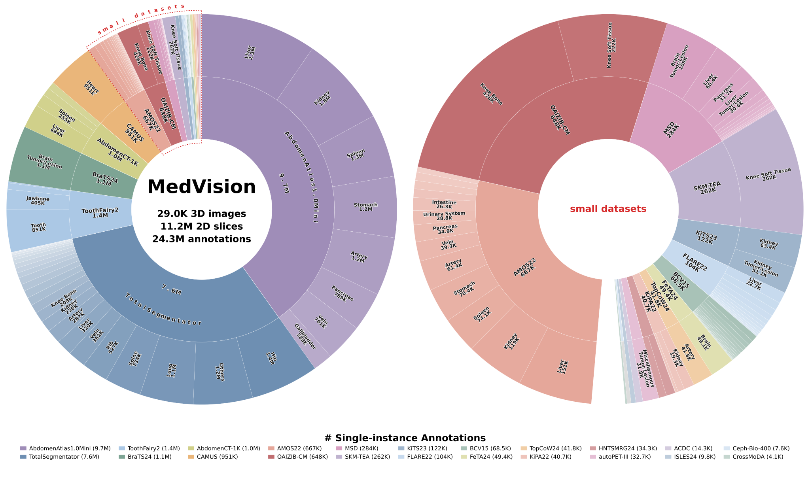
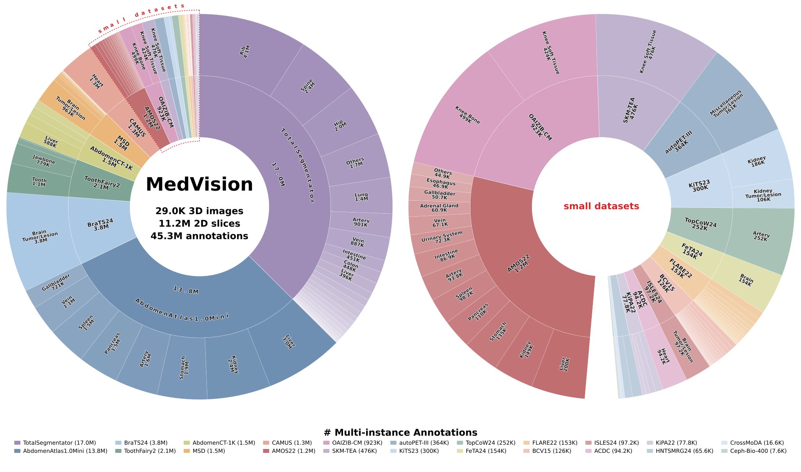

## 🗂️ Images & Annotations

<div class="reveal" markdown="1">

MedVision consolidates **22 public medical imaging datasets** into one
uniformly structured resource: **29K 3D images** and **11.2M annotated 2D slices**, carrying **24.3M
single-instance annotations** and **45.3M multi-instance annotations**. The imaging spans five modalities — X-ray (XR), CT, MRI,
ultrasound (US) and PET — across many anatomical regions.

Source images are kept as *3D volumes reoriented to RAS+* (a canonical right-anterior-superior axis convention),
which makes plane definitions consistent across datasets that were originally stored with different orientations.
MedVision does not ship pre-cut slices: the loader slices volumes to 2D on the fly along any of the three anatomical 
planes — axial, coronal or sagittal — at load time.
This keeps the on-disk footprint tied to the volumes themselves (a full copy is around 1 TB) rather than to an
exploded set of PNGs.

**Segmentation masks.** Every dataset except *Ceph-Biometrics-400* ships with segmentation masks: dense manual
ground truth drawn by expert annotators, and the source of the label names shown in each task's label map below. To
download the image and mask files, load any of a dataset's detection configs — MedVision distributes only the
annotations, and the loader fetches and preprocesses the raw imaging into the dataset folder you specify.

Read more in the documentation: [📚 what MedVision holds](https://medvision.readthedocs.io/en/latest/dataset/concepts.html#what-medvision-holds)
· [📚 the four annotation types](https://medvision.readthedocs.io/en/latest/dataset/concepts.html#the-four-annotation-types)
· [📚 multi-instance vs single-instance annotations](https://medvision.readthedocs.io/en/latest/dataset/concepts.html#multi-instance-vs-single-instance-annotations)

</div>


<div class="mv-divider" role="separator" aria-label="Pilot Study section">
  <span class="mv-divider-rail is-left"></span>
  <span class="mv-divider-node"></span>
  <span class="mv-divider-rail is-right"></span>
</div>


## 📊 Dataset Statistics

<div class="reveal" markdown="1">

Annotation counts per dataset for annotation **v1.1.1**, across the three quantitative tasks — detection (Box),
tumor/lesion size (T/L), and angle/distance (A/D) — with an enlarged panel for the smaller datasets. The two sets
differ only by filtering: **single-instance** keeps a target only when it is a single, large-enough instance, while
**multi-instance** keeps every annotated target whatever its instance count or size.

</div>

<div class="columns is-centered has-text-centered reveal">
  <div class="column is-full">
    
  </div>
</div>

<div class="columns is-centered has-text-centered reveal">
  <div class="column is-full">
    
  </div>
</div>


<div class="mv-divider" role="separator" aria-label="Pilot Study section">
  <span class="mv-divider-rail is-left"></span>
  <span class="mv-divider-node"></span>
  <span class="mv-divider-rail is-right"></span>
</div>


## 🔎 Dataset Explorer

<div class="reveal" markdown="1">

Install the loader dependency first:

```bash
pip install datasets==3.6.0
```

Narrow the **MedVision** data to the subset you need, then copy the exact loading command. 

Pick a **body part**, choose *one or more* **anatomy** labels, and select an **imaging modality** — the explorer lists the dataset configs 
that fit, with a ready-to-run `load_dataset(...)` snippet for each matching test config. Covers the three
quantitative tasks: **detection** (bounding box), **tumor/lesion size** (T/L), and **angle/distance** (A/D).

</div>

<div id="mv-explorer"></div>


<div class="mv-divider" role="separator" aria-label="Report an Issue section">
  <span class="mv-divider-rail is-left"></span>
  <span class="mv-divider-node"></span>
  <span class="mv-divider-rail is-right"></span>
</div>


## 🐛 Report an Issue

<div class="reveal" markdown="1">

MedVision distributes only the annotations — the raw imaging is fetched from **22 upstream hosts**, each of which
can move, re-license or retire its files without notice. If something breaks, please tell us:
[🧑🏻‍💻 open an issue on GitHub](https://github.com/YongchengYAO/MedVision/issues).

Worth reporting:

- **A raw-data download fails.** Usually an upstream source has moved or removed its archive, leaving a stale link
  in the download script.
- **An annotation looks wrong.** A label name, mask, measurement or landmark that does not match the image.

Please include the code snippet and the full error message.

</div>


<div class="mv-divider" role="separator" aria-label="Contribute Data section">
  <span class="mv-divider-rail is-left"></span>
  <span class="mv-divider-node"></span>
  <span class="mv-divider-rail is-right"></span>
</div>


## 🤝 Contribute Data

<div class="reveal" markdown="1">

Two kinds of data contribution are especially welcome.

**1. Suggest a public dataset.** If you know a public medical imaging dataset whose license permits
redistribution, and it carries what MedVision measures — segmentation masks, landmarks, or anything a physical
measurement can be derived from, with spacing metadata in the header — propose it in
[🧑🏻‍💻 a GitHub issue](https://github.com/YongchengYAO/MedVision/issues). We will look at integrating it on the same
terms as the other 22: RAS+ volumes, the same config grammar, and targets in real-world units. The
[📚 dataset guide](https://huggingface.co/blog/YongchengYAO/medvision-dataset) walks through how a dataset is added.

**2. Own proprietary data? Let's build a challenge.** If you hold data you cannot release outright, we are
interested in partnering on a challenge around it: a public split for training alongside a **private test set for fair model comparison**. 
Please get in touch. Contact: [🌏 homepage](https://yongchengyao.github.io/).

</div>
