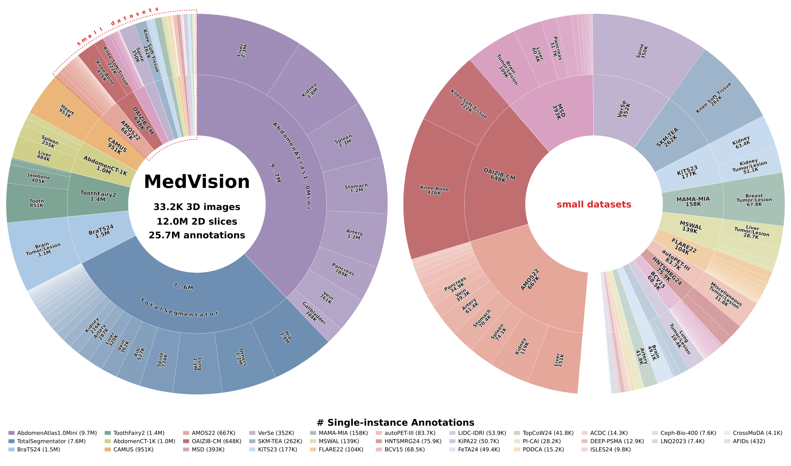
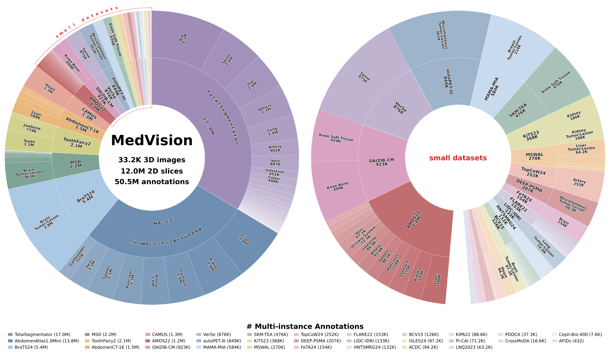
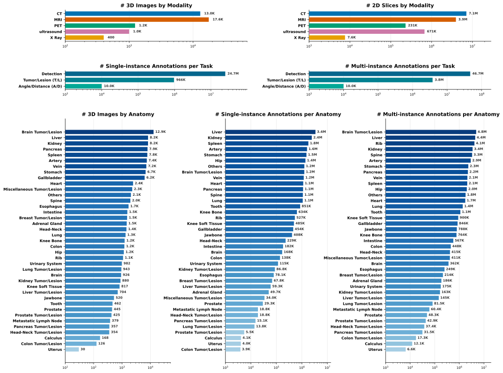

## 🚀 Releases

<div class="reveal" markdown="1">

<ol class="mv-releases">
  <li class="mv-release is-current">
    <time class="mv-release-date" datetime="2026-08-18">Aug 18, 2026</time>
    <span class="mv-release-what">Release MedVision dataset <b>v1.4.0</b></span>
    <span class="mv-release-kind">T/L regeneration<a class="mv-release-fnref" href="#mv-fn5" id="mv-fnref5">5</a></span>
    <a class="mv-release-note" href="https://huggingface.co/datasets/YongchengYAO/MedVision/blob/main/doc/release-v1.4.0.md" target="_blank" rel="noopener">release-v1.4.0</a>
  </li>
  <li class="mv-release">
    <time class="mv-release-date" datetime="2026-08-09">Aug 9, 2026</time>
    <span class="mv-release-what">Release MedVision dataset <b>v1.3.0</b></span>
    <span class="mv-release-kind">new dataset</span>
    <a class="mv-release-note" href="https://huggingface.co/datasets/YongchengYAO/MedVision/blob/main/doc/release-v1.3.0.md" target="_blank" rel="noopener">release-v1.3.0</a>
  </li>
  <li class="mv-release">
    <time class="mv-release-date" datetime="2026-08-03">Aug 3, 2026</time>
    <span class="mv-release-what">Release MedVision dataset <b>v1.2.1</b></span>
    <span class="mv-release-kind">bugfix<a class="mv-release-fnref" href="#mv-fn4" id="mv-fnref4">4</a></span>
    <a class="mv-release-note" href="https://huggingface.co/datasets/YongchengYAO/MedVision/blob/main/doc/release-v1.2.1.md" target="_blank" rel="noopener">release-v1.2.1</a>
  </li>
  <li class="mv-release">
    <time class="mv-release-date" datetime="2026-07-28">Jul 28, 2026</time>
    <span class="mv-release-what">Release MedVision dataset <b>v1.2.0</b></span>
    <span class="mv-release-kind">new datasets</span>
    <span class="mv-release-flag is-bug">withdrawn: MAMA-MIA &amp; PI-CAI<a class="mv-release-fnref" href="#mv-fn3" id="mv-fnref3">3</a></span>
    <a class="mv-release-note" href="https://huggingface.co/datasets/YongchengYAO/MedVision/blob/main/doc/release-v1.2.0.md" target="_blank" rel="noopener">release-v1.2.0</a>
  </li>
  <li class="mv-release">
    <time class="mv-release-date" datetime="2026-06-29">Jun 29, 2026</time>
    <span class="mv-release-what">Release MedVision dataset <b>v1.1.1</b></span>
    <span class="mv-release-kind">bugfix<a class="mv-release-fnref" href="#mv-fn2" id="mv-fnref2">2</a></span>
    <a class="mv-release-note" href="https://huggingface.co/datasets/YongchengYAO/MedVision/blob/main/doc/release-v1.1.1.md" target="_blank" rel="noopener">release-v1.1.1</a>
  </li>
  <li class="mv-release">
    <time class="mv-release-date" datetime="2026-05-14">May 14, 2026</time>
    <span class="mv-release-what">Release MedVision dataset <b>v1.1.0</b></span>
    <span class="mv-release-kind">new filter</span>
    <span class="mv-release-flag is-bug">bug: sagittal/coronal T/L<a class="mv-release-fnref" href="#mv-fn1" id="mv-fnref1b">1</a></span>
    <a class="mv-release-note" href="https://huggingface.co/datasets/YongchengYAO/MedVision/blob/main/doc/release-v1.1.0.md" target="_blank" rel="noopener">release-v1.1.0</a>
  </li>
  <li class="mv-release">
    <time class="mv-release-date" datetime="2025-10-08">Oct 8, 2025</time>
    <span class="mv-release-what">Release MedVision dataset <b>v1.0.0</b></span>
    <span class="mv-release-flag is-bug">bug: sagittal/coronal T/L<a class="mv-release-fnref" href="#mv-fn1" id="mv-fnref1a">1</a></span>
    <span class="mv-release-note is-none">first release</span>
  </li>
</ol>

<ol class="mv-release-fns">
  <li id="mv-fn1">For T/L tasks, use axial slices only — the error in T/L annotations on sagittal and coronal slices is resolved in <b>v1.1.1</b>.</li>
  <li id="mv-fn2">Fixed a T/L annotation error in anisotropic slices (only sagittal and coronal slices).</li>
  <li id="mv-fn3">Missing image reorientation to RAS+: annotations were recorded in the orientation the source shipped, while the loader reoriented the images to RAS+ at loading stage. Withdrawn in <b>v1.2.1</b>.</li>
  <li id="mv-fn4">Reissues the MAMA-MIA &amp; PI-CAI annotations in RAS+. If you have ever loaded either, clear the cache once — the release note has the snippet.</li>
  <li id="mv-fn5">Regenerates the T/L annotations of all 12 tumor/lesion datasets: a millimetre size floor replaces the pixel-count floor, growing published landmarks from 75.8K to 3.8M (50×). Train/test membership changes for six datasets — do not compare a v1.4.0 test metric against an earlier one there.</li>
</ol>

</div>


<div class="mv-divider" role="separator" aria-label="Images and Annotations section">
  <span class="mv-divider-rail is-left"></span>
  <span class="mv-divider-node"></span>
  <span class="mv-divider-rail is-right"></span>
</div>


## 🗂️ Images & Annotations

<div class="reveal" markdown="1">

MedVision consolidates **31 public medical imaging datasets** into one
uniformly structured resource. The imaging spans five modalities — X-ray (XR), CT, MRI,
ultrasound (US) and PET — across many anatomical regions.

Upon release `v1.4.0`, it consists of **33.2K 3D images** and **12.0M annotated 2D
slices**, carrying **25.7M single-instance annotations** and **50.5M multi-instance annotations**.

Source images are stored as *3D volumes reoriented to RAS+* (the canonical right-anterior-superior axis convention),
which keeps plane definitions consistent even when the original datasets use different orientations.
MedVision does not distribute pre-cut PNG slices. Instead, the loader returns the 3D image path, the 2D slice metadata
(slice dimension, slice index, label index, and more), and its annotations.
Keeping the original volumes preserves header metadata, such as pixel spacing and the affine matrix, needed to calculate
measurements in physical units, the information PNGs cannot retain.

**Segmentation masks.** Every dataset except *Ceph-Biometrics-400* — landmark-only —
ships with segmentation masks: dense manual
ground truth drawn by expert annotators, and the source of the label names shown in each task's label map below. To
download the image and mask files, load any of a dataset's detection configs. MedVision distributes only the
annotations, and the loader fetches and preprocesses the raw imaging into the dataset folder you specify.

Read more in the documentation: [📚 what MedVision holds](https://medvision.readthedocs.io/en/latest/dataset/concepts.html#what-medvision-holds)
· [📚 the four annotation types](https://medvision.readthedocs.io/en/latest/dataset/concepts.html#the-four-annotation-types)
· [📚 multi-instance vs single-instance annotations](https://medvision.readthedocs.io/en/latest/dataset/concepts.html#multi-instance-vs-single-instance-annotations)

<div id="mv-annot-preview" class="annot-preview">
  <div class="ap-head">
    <span class="ap-eyebrow"><span class="ap-dot"></span>ANNOTATION PREVIEW · SAMPLED FIGURES</span>
    <div class="ap-head-right">
      <span class="ap-count" id="ap-count">— / —</span>
      <button type="button" class="ap-play-toggle" id="ap-play-toggle" aria-pressed="false" aria-label="Stop rolling">❚❚</button>
    </div>
  </div>

  <div class="mv-tabs">
    <div class="mv-tablist" role="tablist" aria-label="Annotation preview task group">
      <button type="button" class="mv-tab is-active" role="tab" id="ap-tab-tl" aria-controls="ap-panel-tl" aria-selected="true">Tumor / Lesion (T/L)</button>
      <button type="button" class="mv-tab" role="tab" id="ap-tab-ad" aria-controls="ap-panel-ad" aria-selected="false">Angle / Distance (A/D)</button>
    </div>

    <div class="mv-tabpanel" id="ap-panel-tl" role="tabpanel" aria-labelledby="ap-tab-tl">
      <div class="ap-datasets" data-group="TL"></div>
      <div class="ap-viewport" data-group="TL"><div class="ap-track"></div></div>
    </div>

    <div class="mv-tabpanel" id="ap-panel-ad" role="tabpanel" aria-labelledby="ap-tab-ad">
      <div class="ap-datasets" data-group="AD"></div>
      <div class="ap-viewport" data-group="AD"><div class="ap-track"></div></div>
    </div>
  </div>

  <p class="ap-caption">Pre-rendered QC figures — the landmark / ellipse ground truth drawn on each sampled slice, not what the model receives as input.</p>
</div>

</div>


<div class="mv-divider" role="separator" aria-label="Pilot Study section">
  <span class="mv-divider-rail is-left"></span>
  <span class="mv-divider-node"></span>
  <span class="mv-divider-rail is-right"></span>
</div>


## 📊 Dataset Statistics

<div class="reveal" markdown="1">

Annotation counts per dataset for the 31 datasets released through annotation `v1.4.0`, across the three quantitative tasks — detection (Box),
tumor/lesion size (T/L), and angle/distance (A/D). The two sets
differ only by filtering: **single-instance** keeps a target only when it is a single, large-enough instance, while
**multi-instance** keeps every annotated target whatever its instance count or size.

</div>

<div class="columns is-centered has-text-centered reveal">
  <div class="column is-full">
    
  </div>
</div>

<div class="columns is-centered has-text-centered reveal">
  <div class="column is-full">
    
  </div>
</div>

<div class="reveal" markdown="1">

The same collection viewed by **imaging modality** and **anatomy** rather than by dataset. The top
row counts 3D volumes and 2D slices per modality; the bottom row counts volumes and both annotation
views per anatomy group.

Two things to read carefully. The slice counts are summed over all three planes, so one volume
contributes three times. And the anatomy panels do not partition the collection: a volume counts
once in every anatomy group it contains, so a whole-abdomen CT adds to liver, kidney and spleen
alike, and the bars deliberately sum to more than the unique-image total.

</div>

<div class="columns is-centered has-text-centered reveal">
  <div class="column is-full">
    
  </div>
</div>


<div class="mv-divider" role="separator" aria-label="Dataset Preview section">
  <span class="mv-divider-rail is-left"></span>
  <span class="mv-divider-node"></span>
  <span class="mv-divider-rail is-right"></span>
</div>


## 🩻 Dataset Preview

<div class="reveal" markdown="1">

What MedVision covers, before you filter it. Every **body part** on the left connects to the
**anatomy labels** it contains on the right — labels come from each dataset's segmentation masks and
landmark sets, so this is the vocabulary the explorer below searches over.

It reads both ways. Pick a dataset from the panel on top to light up the body parts and anatomy
labels it annotates — or point at any row to light up the datasets that carry it.

</div>

<div id="mv-preview"></div>


<div class="mv-divider" role="separator" aria-label="Dataset Explorer section">
  <span class="mv-divider-rail is-left"></span>
  <span class="mv-divider-node"></span>
  <span class="mv-divider-rail is-right"></span>
</div>


## 🔎 Dataset Explorer

<div class="reveal" markdown="1">

Install the loader dependency first:

```bash
pip install datasets==3.6.0
```

Narrow the **MedVision** data to the subset you need, then copy the exact loading command. 

Pick a **body part**, choose *one or more* **anatomy** labels, and select an **imaging modality** — the explorer lists the dataset configs 
that fit. Choose one, pin an **annotation version**, and say whether you want the **test** split (the benchmark
set) or the **train** split (the source of MedVision-V0's post-training data) — the panel writes a ready-to-run
`load_dataset(...)` snippet for exactly that choice. Subjects are split 70/30%, and each split is its own
config name, so switching moves both the `name=` and the `split=`. Covers the three
quantitative tasks: **detection** (bounding box), **tumor/lesion size** (T/L), and **angle/distance** (A/D).

</div>

<div id="mv-explorer"></div>


<div class="mv-divider" role="separator" aria-label="Annotation Version Control section">
  <span class="mv-divider-rail is-left"></span>
  <span class="mv-divider-node"></span>
  <span class="mv-divider-rail is-right"></span>
</div>


## 📌 Annotation Version Control

<div class="reveal" markdown="1">

MedVision annotations are versioned. `MedVision_PLANNER_VERSION` chooses which ones you load, and
the loader will not start without it. Setting it to `latest` is recommended.
The rest of this section is only for pinning an older version.

The setting is a **ceiling**, not an exact match: you get the newest annotations published at or
before the version you name, separately for each annotation type.

**Pinning below a dataset's newest annotation needs acknowledgement.** Say you
pinned `1.1.0`, and release `1.1.1` later fixed an error and updated the annotations.
Since the data loader defaults to updating the dataset codebase `medvision_ds` first, it
checks the newest annotation version against the one you pinned. If the requested version
is older than the latest, loading pauses and you are prompted to read the release note.
Read it carefully to judge whether the update is essential. You can then take the updated
version, or keep the old one by setting `MedVision_ACK_RELEASE` to either of the values below.

- **`1.1.1` — that dataset's newest annotation.** It goes stale on purpose: correct that data again
  and the number changes, so you are asked again.
- **`1.4.0` — the release.** Reads as *I have read release `1.4.0`*. Use it for a sweep: one
  variable holds one value, but a sweep spans datasets at different newest versions, so only the
  release clears them all. It always names the current release, so a `1.3.0` acknowledgement no
  longer clears anything; a per-dataset value like `1.1.1` still does, because that dataset's
  annotations did not change.

In the selector below, rows are datasets and the first three columns are detection, tumor/lesion
size and angle/distance. A cell's bars are that config's annotation versions: the highlighted bar is
what you get, and a bar to its right is a newer annotation you are skipping. Its number — the value
to acknowledge with — repeats in the last column. Any other value is refused.

<div id="mv-versions"></div>

Full detail in the [📚 v1.4.0 release note](https://huggingface.co/datasets/YongchengYAO/MedVision/blob/main/doc/release-v1.4.0.md)
· [📚 v1.3.0 release note](https://huggingface.co/datasets/YongchengYAO/MedVision/blob/main/doc/release-v1.3.0.md)
· [📚 v1.2.1 release note](https://huggingface.co/datasets/YongchengYAO/MedVision/blob/main/doc/release-v1.2.1.md)
· [📚 v1.2.0 release note](https://huggingface.co/datasets/YongchengYAO/MedVision/blob/main/doc/release-v1.2.0.md)
· [📚 loading a config](https://medvision.readthedocs.io/en/latest/dataset/loading.html)

</div>


<div class="mv-divider" role="separator" aria-label="Report an Issue section">
  <span class="mv-divider-rail is-left"></span>
  <span class="mv-divider-node"></span>
  <span class="mv-divider-rail is-right"></span>
</div>


## 🐛 Report an Issue

<div class="reveal" markdown="1">

MedVision distributes only the annotations — the raw imaging is fetched from **31 upstream hosts**, each of which
can move, re-license or retire its files without notice. If something breaks, please tell us:
[🧑🏻‍💻 open an issue on GitHub](https://github.com/YongchengYAO/MedVision/issues).

Worth reporting:

- **A raw-data download fails.** Usually an upstream source has moved or removed its archive, leaving a stale link
  in the download script.
- **An annotation looks wrong.** A label name, mask, measurement or landmark that does not match the image.

Please include the code snippet and the full error message.

</div>


<div class="mv-divider" role="separator" aria-label="Contribute Data section">
  <span class="mv-divider-rail is-left"></span>
  <span class="mv-divider-node"></span>
  <span class="mv-divider-rail is-right"></span>
</div>


## 🤝 Contribute Data

<div class="reveal" markdown="1">

Two kinds of data contribution are especially welcome.

**1. Suggest a public dataset.** If you know a public medical imaging dataset whose license permits
redistribution, and it carries what MedVision measures — segmentation masks, landmarks, or anything a physical
measurement can be derived from, with spacing metadata in the header — propose it in
[🧑🏻‍💻 a GitHub issue](https://github.com/YongchengYAO/MedVision/issues). We will look at integrating it on the same
terms as the other 31: RAS+ volumes, the same config grammar, and targets in real-world units. The
[📚 dataset guide](https://huggingface.co/blog/YongchengYAO/medvision-dataset) walks through how a dataset is added.

**2. Own proprietary data? Let's build a challenge.** If you hold data you cannot release outright, we are
interested in partnering on a challenge around it: a public split for training alongside a **private test set for fair model comparison**. 
Please get in touch. Contact: [🌏 homepage](https://yongchengyao.github.io/).

</div>


<div class="mv-divider" role="separator" aria-label="How to Cite section">
  <span class="mv-divider-rail is-left"></span>
  <span class="mv-divider-node"></span>
  <span class="mv-divider-rail is-right"></span>
</div>


## 📄 How to Cite

<div class="reveal" markdown="1">

MedVision is a meta-dataset, and any use of it draws on two distinct contributions. The imaging
data, segmentation masks and accompanying metadata are contributed by the **source dataset
providers**; the quantitative annotations derived from them — bounding boxes, tumor/lesion sizes,
and angle/distance measurements — are contributed by **MedVision**. Please credit both: cite the
publication accompanying each source dataset you use, together with the MedVision paper.

A methods or data-availability statement might read:

> Imaging data and segmentation masks were obtained from AbdomenAtlas (Li et al., 2024); the
> quantitative annotations used in this study were provided by MedVision (Yao et al., 2026).

**Finding the source publication.** Select a dataset in the [🔎 Dataset Explorer](#-dataset-explorer)
above — each dataset panel lists its **Paper**, **Website**, **Source** and **License**, so the
reference you need for any config is already on this page. Several datasets record more than one
publication; cite every entry listed.

Citing a source dataset is not a substitute for complying with its terms. The licence of each source
dataset continues to govern how its imaging may be used and redistributed, independently of
MedVision's own licence. The BibTeX entry for MedVision is at the foot of this page.

</div>
