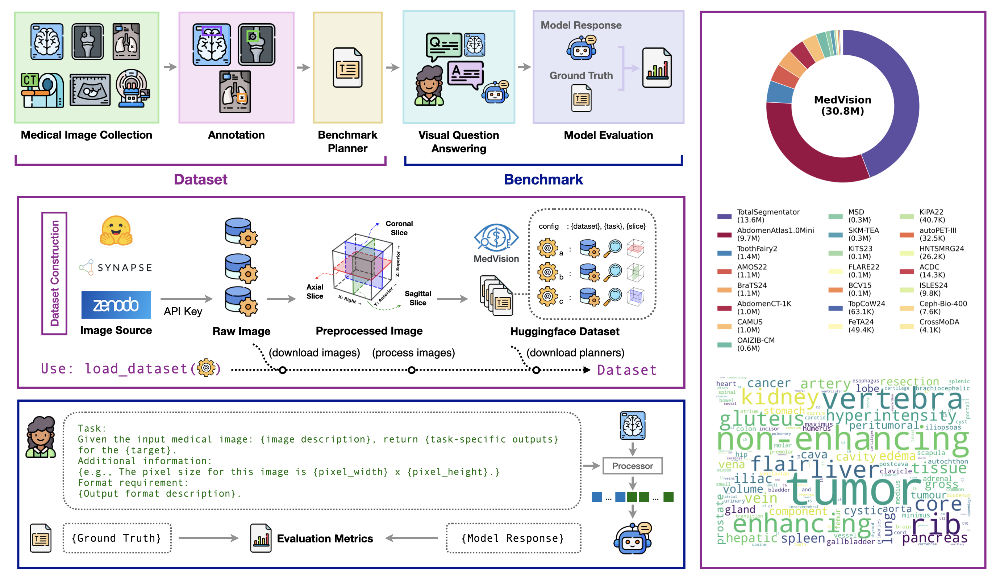
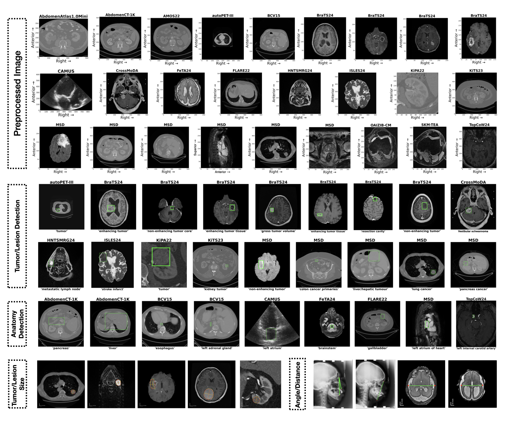
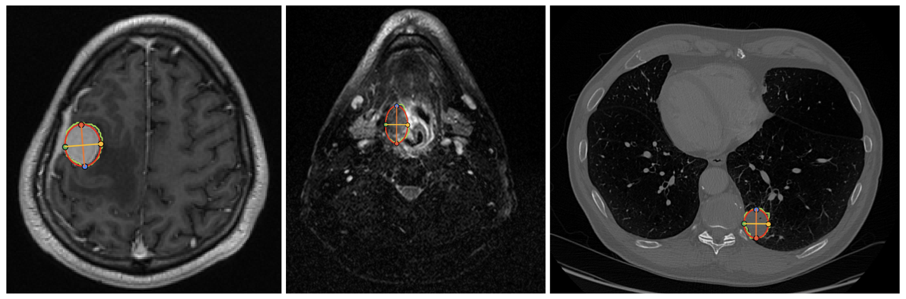
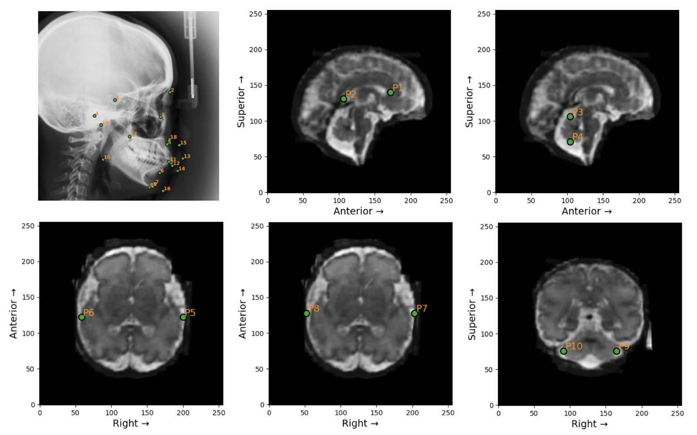

  

    
  

## 🌟 Highlights

* **Research Gap**: modern VLMs are not reliably able to produce precise quantitative measurements from medical images.
* **Dataset**: MedVision, a large-scale, multi-modality dataset for quantitative medical image analysis, covering 22 public datasets and 30.8M images with structured measurement annotations.
* **Benchmark**: the first comprehensive evaluation of contemporary VLMs on detection, tumor/lesion size estimation, and angle/distance measurement.
* **Supervised Finetuning (SFT)**: SFT can improve the performance of VLMs on quantitative medical image analysis tasks.
* **Code and Models**: data, model checkpoints, and code (training and evaluation) are available 

## 📀 Dataset

**MedVision** includes 22 public datasets and 30.8M image-annotation pairs. The dataset is available at [here](https://huggingface.co/datasets/YongchengYAO/MedVision). Details are as follows:

<b>Table 1:</b> The MedVision dataset consists of public medical images and quantitative annotations from this study. MRI: Magnetic Resonance Imaging; CT: Computed Tomography; PET: positron emission tomography; US: Ultrasound; b-box: bounding box; T/L: tumor/lesion size; A/D: angle/distance; HF: HuggingFace; GC: Grand-Challenge; &dagger; redistributed.

<table>
  <thead>
    <tr>
      <th rowspan="2"><b>Dataset</b></th>
      <th rowspan="2"><b>Anatomy</b></th>
      <th rowspan="2"><b>Modality</b></th>
      <th rowspan="2"><b>Annotation</b></th>
      <th rowspan="2"><b>Availability</b></th>
      <th rowspan="2"><b>Source</b></th>
      <th colspan="3"><b># Sample (Train / Test)</b></th>
    </tr>
    <tr>
      <th><b>b-box</b></th>
      <th><b>T/L</b></th>
      <th><b>A/D</b></th>
    </tr>
  </thead>
  <tbody>
    <tr><td>AbdomenAtlas</td><td>abdomen</td><td>CT</td><td>b-box</td><td>open</td><td>HF</td><td>6.8 / 2.9M</td><td>0</td><td>0</td></tr>
    <tr><td>AbdomenCT-1K</td><td>abdomen</td><td>CT</td><td>b-box</td><td>open</td><td>Zenodo</td><td>0.7 / 0.3M</td><td>0</td><td>0</td></tr>
    <tr><td>ACDC</td><td>heart</td><td>MRI</td><td>b-box</td><td>open</td><td>HF&dagger;, others</td><td>9.5 / 4.8K</td><td>0</td><td>0</td></tr>
    <tr><td>AMOS22</td><td>abdomen</td><td>CT, MRI</td><td>b-box</td><td>open</td><td>Zenodo</td><td>0.8 / 0.3M</td><td>0</td><td>0</td></tr>
    <tr><td>autoPEI-III</td><td>whole body</td><td>CT, PET</td><td>b-box, T/L</td><td>open</td><td>HF&dagger;, others</td><td>22 / 9.7K</td><td>0.5 / 0.2K</td><td>0</td></tr>
    <tr><td>BCV15</td><td>abdomen</td><td>CT</td><td>b-box</td><td>open</td><td>HF&dagger;, Synapse</td><td>71 / 30K</td><td>0</td><td>0</td></tr>
    <tr><td>BraTS24</td><td>brain</td><td>MRI</td><td>b-box, T/L</td><td>open</td><td>HF&dagger;, Synapse</td><td>0.8 / 0.3M</td><td>7.9 / 3.1K</td><td>0</td></tr>
    <tr><td>CAMUS</td><td>heart</td><td>US</td><td>b-box</td><td>open</td><td>HF&dagger;, others</td><td>0.7 / 0.3M</td><td>0</td><td>0</td></tr>
    <tr><td>Ceph-Bio-400</td><td>head and neck</td><td>X-ray</td><td>b-box, A/D</td><td>open</td><td>HF&dagger;, others</td><td>0</td><td>0</td><td>5.3 / 2.3K</td></tr>
    <tr><td>CrossModDA</td><td>brain</td><td>MRI</td><td>b-box</td><td>open</td><td>HF&dagger;, Zenodo</td><td>3.0 / 1.0K</td><td>0</td><td>0</td></tr>
    <tr><td>FeTA24</td><td>fetal brain</td><td>MRI</td><td>b-box, A/D</td><td>registration</td><td>Synapse</td><td>34 / 15K</td><td>0</td><td>0.2 / 0.1K</td></tr>
    <tr><td>FLARE22</td><td>abdomen</td><td>CT</td><td>b-box</td><td>open</td><td>HF&dagger;, others</td><td>72 / 33K</td><td>0</td><td>0</td></tr>
    <tr><td>HNTSMRG24</td><td>head and neck</td><td>MRI</td><td>b-box, T/L</td><td>open</td><td>Zenodo</td><td>18 / 6.6K</td><td>1.0 / 0.4K</td><td>0</td></tr>
    <tr><td>ISLES24</td><td>brain</td><td>MRI</td><td>b-box</td><td>open</td><td>HF&dagger;, GC</td><td>7.3 / 2.5K</td><td>0</td><td>0</td></tr>
    <tr><td>KiPA22</td><td>kidney</td><td>CT</td><td>b-box, T/L</td><td>open</td><td>HF&dagger;, GC</td><td>26 / 11K</td><td>2.1 / 1.0K</td><td>0</td></tr>
    <tr><td>KiTS23</td><td>kidney</td><td>CT</td><td>b-box, T/L</td><td>open</td><td>HF&dagger;, GC</td><td>80 / 35K</td><td>5.9 / 2.6K</td><td>0</td></tr>
    <tr><td>MSD</td><td>multiple</td><td>CT, MRI</td><td>b-box, T/L</td><td>open</td><td>others</td><td>0.2 / 0.1M</td><td>5.3 / 2.2K</td><td>0</td></tr>
    <tr><td>OAIZIB-CM</td><td>knee</td><td>MRI</td><td>b-box</td><td>open</td><td>HF</td><td>0.5 / 0.2M</td><td>0</td><td>0</td></tr>
    <tr><td>SKM-TEA</td><td>knee</td><td>MRI</td><td>b-box</td><td>registration</td><td>others</td><td>0.2 / 0.1M</td><td>0</td><td>0</td></tr>
    <tr><td>ToothFairy2</td><td>tooth</td><td>CT</td><td>b-box</td><td>registration</td><td>others</td><td>1.0 / 0.4M</td><td>0</td><td>0</td></tr>
    <tr><td>TopCoW24</td><td>brain</td><td>CT, MRI</td><td>b-box</td><td>open</td><td>HF&dagger;, Zenodo</td><td>43 / 20K</td><td>0</td><td>0</td></tr>
    <tr><td>TotalSegmentator</td><td>multiple</td><td>CT, MRI</td><td>b-box</td><td>open</td><td>HF&dagger;, Zenodo</td><td>9.6 / 4.0M</td><td>0</td><td>0</td></tr>
    <tr><td><b>Total</b></td><td></td><td></td><td></td><td></td><td></td><td><b>22 / 9.2M</b></td><td><b>23 / 9.6K</b></td><td><b>5.6 / 2.4K</b></td></tr>
  </tbody>
</table>

  

    
  

**Q: How to use the dataset?** 
- [Quick start](https://huggingface.co/datasets/YongchengYAO/MedVision#use)
- Prepare dataset for MedVision benchmarking and finetuning: [here](https://github.com/YongchengYAO/MedVision?tab=readme-ov-file#-data-downloading-optional)

## 1️⃣ Detection

**Q: Can VLMs localize healthy anatomical structures and abnormalities from medical images?**
- Pretrained VLMs show limited ability in medical image detection tasks. 
- With SFT, VLMs achieve dramatic improvement in the detection of both healthy anatomical structures and tumors/lesions.
- Small object and tumors/lesions detection is still challenging.
- SFT improves models’ generalizability (details in paper)

### Group-level detection performance

<b>Table 2:</b> VLM performance on detection tasks. Targets are grouped into health anatomy and tumor/lesion detection tasks. Mean metrics weighted by sample sizes are reported in %. R: recall; P: precision; F1: F1 score; IoU: intersection over union; SR: success rate.

<table>
  <thead>
    <tr>
      <th rowspan="2"><b>Model</b></th>
      <th colspan="6"><b>Anatomy</b></th>
      <th colspan="6"><b>Tumor/Lesion</b></th>
    </tr>
    <tr>
      <th><b>R</b> &uarr;</th>
      <th><b>P</b> &uarr;</th>
      <th><b>F1</b> &uarr;</th>
      <th><b>IoU</b> &uarr;</th>
      <th><b>SR</b> &uarr;</th>
      <th><b>IoU&gt;0.5</b> &uarr;</th>
      <th><b>R</b> &uarr;</th>
      <th><b>P</b> &uarr;</th>
      <th><b>F1</b> &uarr;</th>
      <th><b>IoU</b> &uarr;</th>
      <th><b>SR</b> &uarr;</th>
      <th><b>IoU&gt;0.5</b> &uarr;</th>
    </tr>
  </thead>
  <tbody>
    <tr><td>Qwen2.5-VL (7B)</td><td>50.4</td><td>9.5</td><td>12.4</td><td>7.6</td><td>100</td><td>1.4</td><td>54.5</td><td>3.4</td><td>5.6</td><td>3.1</td><td>100</td><td>0.0</td></tr>
    <tr><td>Qwen2.5-VL (32B)</td><td>35.2</td><td>13.6</td><td>16.1</td><td>11.0</td><td>99.7</td><td>5.7</td><td>38.0</td><td>6.2</td><td>8.4</td><td>5.1</td><td>99.9</td><td>0.7</td></tr>
    <tr><td>Lingshu (32B)</td><td>26.4</td><td>19.1</td><td>17.3</td><td>11.6</td><td>100</td><td>4.0</td><td>23.1</td><td>5.9</td><td>7.2</td><td>4.4</td><td>100</td><td>0.6</td></tr>
    <tr><td>InternVL3 (38B)</td><td>24.5</td><td>14.5</td><td>14.5</td><td>9.8</td><td>100</td><td>5.3</td><td>39.2</td><td>5.9</td><td>7.6</td><td>4.5</td><td>100</td><td>0.4</td></tr>
    <tr><td>Gemma3 (27B)</td><td>33.3</td><td>17.4</td><td>19.4</td><td>13.7</td><td>100</td><td>9.9</td><td>33.4</td><td>5.1</td><td>6.6</td><td>4.0</td><td>100</td><td>0.5</td></tr>
    <tr><td>MedGemma (4B)</td><td>66.2</td><td>16.3</td><td>19.0</td><td>12.8</td><td>100</td><td>7.2</td><td><u>72.1</u></td><td>5.2</td><td>8.6</td><td>4.9</td><td>99.6</td><td>0.2</td></tr>
    <tr><td>MedGemma (27B)</td><td>65.6</td><td>17.3</td><td>19.3</td><td>12.9</td><td>100</td><td>6.5</td><td>65.8</td><td>5.7</td><td>8.8</td><td>5.1</td><td>100</td><td>0.2</td></tr>
    <tr><td>Llama3.2-Vision (11B)</td><td>47.0</td><td>8.1</td><td>10.4</td><td>6.8</td><td>73.8</td><td>2.7</td><td>45.6</td><td>2.1</td><td>3.6</td><td>2.0</td><td>70.1</td><td>0.0</td></tr>
    <tr><td>LLava-OneVision (72B)</td><td>36.4</td><td>17.8</td><td>18.5</td><td>12.3</td><td>100</td><td>4.4</td><td>38.1</td><td>6.0</td><td>8.5</td><td>5.1</td><td>100</td><td>0.4</td></tr>
    <tr><td>LLaVA-Med-v1.5 (7B)</td><td>60.7</td><td>15.7</td><td>18.6</td><td>12.6</td><td>99.1</td><td>7.0</td><td>50.6</td><td>4.7</td><td>7.3</td><td>4.3</td><td>89.0</td><td>0.8</td></tr>
    <tr><td>MedDr (40B)</td><td>64.4</td><td>11.9</td><td>17.3</td><td>11.3</td><td>99.8</td><td>4.1</td><td><b>74.9</b></td><td>4.4</td><td>7.5</td><td>4.3</td><td>97.8</td><td>0.1</td></tr>
    <tr><td>HuatuoGPT-Vision (34B)</td><td>25.3</td><td>20.5</td><td>16.3</td><td>10.7</td><td>100</td><td>3.6</td><td>20.8</td><td>5.9</td><td>7.0</td><td>4.3</td><td>100</td><td>0.6</td></tr>
    <tr><td>HealthGPT-L14</td><td>21.0</td><td>15.2</td><td>13.5</td><td>8.3</td><td>100</td><td>0.5</td><td>22.7</td><td>6.2</td><td>6.8</td><td>4.2</td><td>100</td><td>0.5</td></tr>
    <tr style="border-top: 1px solid #ccc;"><td>Gemini2.5-Flash (w/o tool)</td><td>35.4</td><td>16.1</td><td>18.7</td><td>12.8</td><td>99.5</td><td>6.8</td><td>41.4</td><td>7.1</td><td>10.1</td><td>6.3</td><td>98.3</td><td>1.2</td></tr>
    <tr><td>Gemini2.5-Flash (w tool)</td><td>29.9</td><td>13.0</td><td>15.2</td><td>10.6</td><td>82.0</td><td>5.8</td><td>38.4</td><td>9.1</td><td>10.2</td><td>6.9</td><td>77.8</td><td>3.6</td></tr>
    <tr style="border-top: 1px solid #ccc;"><td>Qwen2.5-VL (7B, SFT1M)</td><td><u>80.6</u></td><td>79.1</td><td><u>78.2</u></td><td><u>71.6</u></td><td>100</td><td><u>79.5</u></td><td>55.8</td><td><u>51.6</u></td><td><u>49.4</u></td><td><u>41.2</u></td><td>100</td><td><u>46.2</u></td></tr>
    <tr><td>Qwen2.5-VL (32B, SFT1M)</td><td><b>82.1</b></td><td><b>83.4</b></td><td><b>81.2</b></td><td><b>74.6</b></td><td>100</td><td><b>82.8</b></td><td>58.7</td><td><b>54.8</b></td><td><b>52.6</b></td><td><b>44.3</b></td><td>100</td><td><b>49.5</b></td></tr>
  </tbody>
</table>

### Label-level detection performance
This figure shows the detection metrics per label and box-to-image ratio (that indicates relative target size) for each models.

  

    
  

## 2️⃣ Tumor/Lesion Size Estimation
**Q: Can VLMs estimate the size of tumors/lesions from medical images?**

- Mean relative error (MRE) for SFT models are ∼ 30%, while it is 50~120% for off-the-shelf VLMs
- SFT improves models’ generalizability (details in paper)

VLMs are asked to estimate the longest diameter and its perpendicular diameter of tumors/lesions. An example of the quantitative annotations from this work is shown below.

  

    
  

<b>Figure 2:</b> Tumor/lesion size annotation. An ellipse is fitted to the tumor/lesion mask and 4 landmarks are recorded.
 

<b>Table 3:</b> VLM performance on tumor/lesion size estimation tasks. Mean relative error (MRE), success rate (SR), and MRE&lt;k are reported in %, while mean absolute error (MAE) is in millimeters.

<table>
  <thead>
    <tr>
      <th><b>Model</b></th>
      <th><b>MAE</b> &darr;</th>
      <th><b>MRE</b> &darr;</th>
      <th><b>SR</b> &uarr;</th>
      <th><b>MRE&lt;0.1</b> &uarr;</th>
      <th><b>MRE&lt;0.2</b> &uarr;</th>
      <th><b>MRE&lt;0.3</b> &uarr;</th>
    </tr>
  </thead>
  <tbody>
    <tr><td>Qwen2.5-VL (7B)</td><td>32.3</td><td>71.5</td><td>100.0</td><td>0.3</td><td>1.7</td><td>3.2</td></tr>
    <tr><td>Qwen2.5-VL (32B)</td><td>24.2</td><td>51.9</td><td>100.0</td><td>2.7</td><td>11.8</td><td>19.9</td></tr>
    <tr><td>Lingshu (32B)</td><td>23.9</td><td>66.1</td><td>100.0</td><td>10.4</td><td>29.7</td><td>43.4</td></tr>
    <tr><td>InternVL3 (38B)</td><td>22.6</td><td>50.1</td><td>100.0</td><td>4.5</td><td>15.0</td><td>24.2</td></tr>
    <tr><td>Gemma3 (27B)</td><td>30.7</td><td>70.7</td><td>100.0</td><td>1.4</td><td>4.9</td><td>8.7</td></tr>
    <tr><td>MedGemma (4B)</td><td>38.9</td><td>116.8</td><td>100.0</td><td>1.1</td><td>4.5</td><td>7.6</td></tr>
    <tr><td>MedGemma (27B)</td><td>38.9</td><td>116.9</td><td>100.0</td><td>1.1</td><td>4.3</td><td>7.5</td></tr>
    <tr><td>Llama3.2-Vision (11B)</td><td>25.7</td><td>61.9</td><td>99.1</td><td>4.6</td><td>14.0</td><td>21.1</td></tr>
    <tr><td>LLava-OneVision (72B)</td><td>26.2</td><td>83.0</td><td>100.0</td><td>4.8</td><td>17.7</td><td>29.4</td></tr>
    <tr><td>LLaVA-Med-v1.5 (7B)</td><td>48.8</td><td>74.7</td><td>22.6</td><td>0.3</td><td>0.6</td><td>1.1</td></tr>
    <tr><td>MedDr (40B)</td><td>30.1</td><td>73.8</td><td>100.0</td><td>1.6</td><td>4.7</td><td>9.4</td></tr>
    <tr><td>HuatuoGPT-Vision (34B)</td><td>28.9</td><td>89.1</td><td>100.0</td><td>8.5</td><td>26.2</td><td>42.3</td></tr>
    <tr><td>HealthGPT-L14</td><td>23.6</td><td>61.3</td><td>98.9</td><td>8.0</td><td>22.6</td><td>35.8</td></tr>
    <tr style="border-top: 1px solid #ccc;"><td>Qwen2.5-VL (7B, SFT5K)</td><td><u>13.2</u></td><td><u>30.6</u></td><td>100.0</td><td><b>20.8</b></td><td><u>41.5</u></td><td><u>62.1</u></td></tr>
    <tr><td>Qwen2.5-VL (32B, SFT5K)</td><td><b>12.8</b></td><td><b>30.2</b></td><td>100.0</td><td><u>19.6</u></td><td><b>43.2</b></td><td><b>63.2</b></td></tr>
  </tbody>
</table>

## 3️⃣ Angle/Distance Measurement

**Q: Can VLMs measure angles or distances from medical image?**

- Off-the-shelf VLMs fail to measure angles and distances accurately.
- SFT can significantly improve performance.
- Small-angle measurements remain challenging.

VLMs are prompted with task description and definition of angle or distance. Examples of landmarks in the Ceph-Bio-400 and FeTA24 datasets are shown below.

  

    
  

<b>Figure 3:</b> Landmarks in the Ceph-Bio-400 (top-left) and FeTA24 datasets. Ground truth angle and distance measurements are calculated from these landmarks.
 

<b>Table 4:</b> VLM performance on angle and distance measurement tasks. Mean relative errors (MRE), MRE&lt;0.1, and success rate (SR) are reported in %. Mean absolute errors (MAE) are given in millimeters (distance) and degrees (angle).

<table>
  <thead>
    <tr>
      <th rowspan="3"><b>Model</b></th>
      <th colspan="8"><b>Ceph-Bio-400</b></th>
      <th colspan="4"><b>FeTA24</b></th>
    </tr>
    <tr>
      <th colspan="4"><b>Distance</b></th>
      <th colspan="4"><b>Angle</b></th>
      <th colspan="4"><b>Distance</b></th>
    </tr>
    <tr>
      <th><b>MAE</b> &darr;</th>
      <th><b>MRE</b> &darr;</th>
      <th><b>SR</b> &uarr;</th>
      <th><b>MRE&lt;0.1</b> &uarr;</th>
      <th><b>MAE</b> &darr;</th>
      <th><b>MRE</b> &darr;</th>
      <th><b>SR</b> &uarr;</th>
      <th><b>MRE&lt;0.1</b> &uarr;</th>
      <th><b>MAE</b> &darr;</th>
      <th><b>MRE</b> &darr;</th>
      <th><b>SR</b> &uarr;</th>
      <th><b>MRE&lt;0.1</b> &uarr;</th>
    </tr>
  </thead>
  <tbody>
    <tr><td>Qwen2.5-VL (7B)</td><td>56.3</td><td>80.1</td><td>100</td><td>0.9</td><td>55.1</td><td>3691</td><td>98.7</td><td>3.4</td><td>27.5</td><td>61.6</td><td>100</td><td>2.0</td></tr>
    <tr><td>Qwen2.5-VL (32B)</td><td>59.7</td><td>86.0</td><td>100</td><td>0.2</td><td>41.0</td><td>3287</td><td>100</td><td>2.0</td><td>19.5</td><td>49.6</td><td>100</td><td>6.0</td></tr>
    <tr><td>Lingshu (32B)</td><td>17.3</td><td>26.1</td><td>100</td><td>15.5</td><td>31.2</td><td>4648</td><td>100</td><td>10.4</td><td>38.5</td><td>120.9</td><td>100</td><td>0.0</td></tr>
    <tr><td>InternVL3 (38B)</td><td>22.1</td><td>38.2</td><td>100</td><td>11.1</td><td>66.1</td><td>4405</td><td>100</td><td>4.3</td><td>19.7</td><td>54.7</td><td>100</td><td>11.0</td></tr>
    <tr><td>Gemma3 (27B)</td><td>22.6</td><td>32.3</td><td>100</td><td>22.4</td><td>33.6</td><td>7862</td><td>100</td><td>13.8</td><td>18.1</td><td>40.2</td><td>100</td><td>15.0</td></tr>
    <tr><td>MedGemma (4B)</td><td>43.4</td><td>67.9</td><td>100</td><td>6.5</td><td>30.5</td><td>2780</td><td>100</td><td>5.8</td><td>26.2</td><td>60.4</td><td>100</td><td>5.0</td></tr>
    <tr><td>MedGemma (27B)</td><td>43.9</td><td>68.8</td><td>100</td><td>6.4</td><td>29.9</td><td>2168</td><td>100</td><td>6.4</td><td>26.2</td><td>60.4</td><td>100</td><td>5.0</td></tr>
    <tr><td>Llama3.2-Vision (11B)</td><td>81.6</td><td>117.4</td><td>100</td><td>2.9</td><td>55.3</td><td>9318.6</td><td>100</td><td>8.0</td><td>29.9</td><td>73.4</td><td>100</td><td>2.0</td></tr>
    <tr><td>LLava-OneVision (72B)</td><td>36.3</td><td>67.8</td><td>100</td><td>18.8</td><td>62.6</td><td>12269.1</td><td>100</td><td>0.0</td><td>46.0</td><td>130.7</td><td>100</td><td>4.0</td></tr>
    <tr><td>MedDr (40B)</td><td>33.7</td><td>53.6</td><td>100</td><td>6.0</td><td>54.8</td><td>9149.2</td><td>100</td><td>0.2</td><td>37.1</td><td>78.5</td><td>100</td><td>5.0</td></tr>
    <tr><td>HuatuoGPT-Vision (34B)</td><td>45.8</td><td>65.2</td><td>100</td><td>2.8</td><td>65.8</td><td>5741.1</td><td>100</td><td>9.0</td><td>40.5</td><td>83.3</td><td>100</td><td>15.0</td></tr>
    <tr><td>HealthGPT-L14</td><td>66.8</td><td>97.5</td><td>100</td><td>1.1</td><td>42.9</td><td><u>434.6</u></td><td>100</td><td>0.0</td><td>32.1</td><td>79.4</td><td>100</td><td>5.0</td></tr>
    <tr style="border-top: 1px solid #ccc;"><td>Qwen2.5-VL (7B, SFT5K)</td><td><b>3.5</b></td><td><b>5.4</b></td><td>100</td><td><b>86.4</b></td><td><b>3.6</b></td><td><b>126.8</b></td><td>100</td><td><u>50.1</u></td><td><b>4.1</b></td><td><b>13.1</b></td><td>100</td><td><u>49.0</u></td></tr>
    <tr><td>Qwen2.5-VL (32B, SFT5K)</td><td><u>4.5</u></td><td><u>7.9</u></td><td>100</td><td><u>83.5</u></td><td><u>4.0</u></td><td>540.2</td><td>100</td><td><b>50.5</b></td><td><b>4.1</b></td><td><u>14.0</u></td><td>100</td><td><b>54.0</b></td></tr>
  </tbody>
</table>
