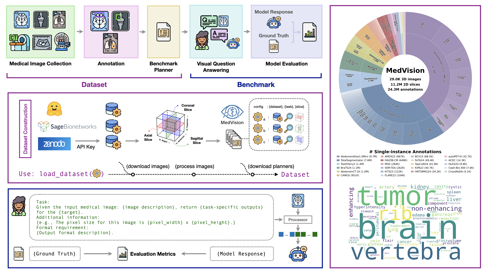
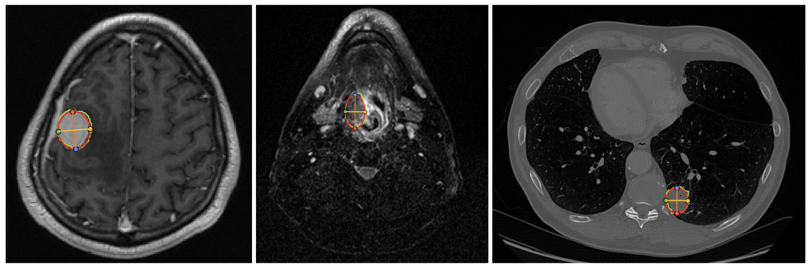
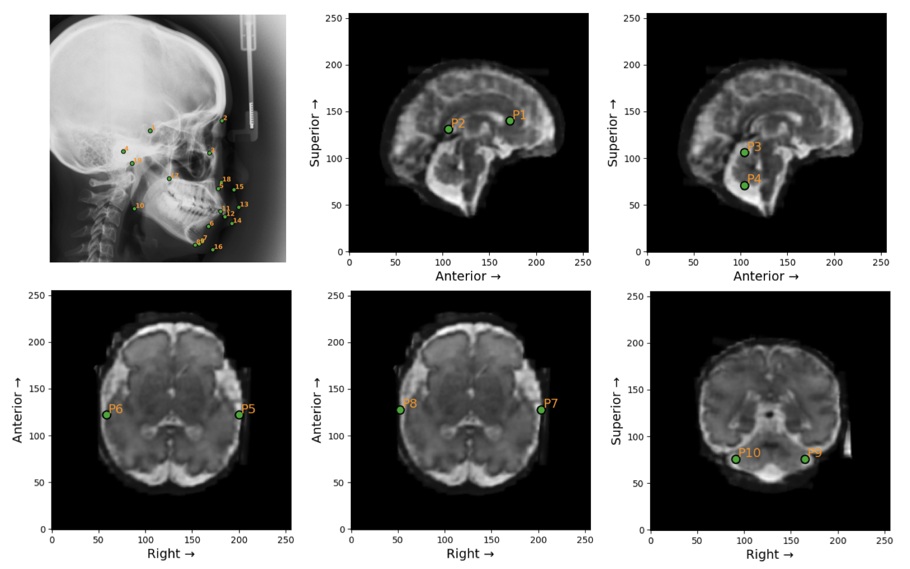
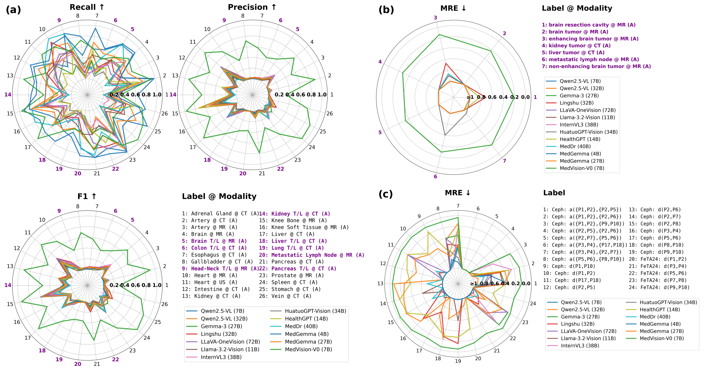

  

    
  

## 🌟 Highlights

* **Research gap.** Modern VLMs cannot reliably produce precise quantitative measurements from medical images.
* **Dataset.** MedVision — a large-scale, multi-anatomy, multi-modality dataset for quantitative medical image analysis (22 public datasets, 30.8M image-annotation pairs).
* **Benchmark.** The first comprehensive evaluation of contemporary VLMs on detection, tumor/lesion (T/L) size estimation, and angle/distance (A/D) measurement in medical images.
* **Model.** MedVision-V0, a 7B model trained on MedVision via supervised fine-tuning (SFT) and reinforcement fine-tuning (RFT); it significantly outperforms all evaluated VLMs across all three tasks — a strong, open baseline.
* **Open release.** Data, model, and code (training and evaluation) are all publicly available.

## 🎯 Problem & Tasks

Clinical decisions rely on quantitative assessment — measuring a tumor to stage disease, a joint angle to plan surgery, an anatomical distance to track development. We therefore target a concrete model ability: ***given a medical image, produce precise numeric measurements in real-world physical units*** (millimeters and degrees, *not* pixels). 

MedVision evaluates this ability across three quantitative tasks:

  

    <h3>1️⃣ Detection</h3>
    
Localize healthy anatomical structures and abnormalities with bounding boxes.

  

  

    <h3>2️⃣ Tumor/Lesion Size</h3>
    
Estimate the longest diameter (major axis) and its perpendicular diameter (minor axis) of a tumor/lesion, reported in millimeters.

  

  

    <h3>3️⃣ Angle/Distance</h3>
    
Measure angles (degrees) and distances (mm) from anatomical landmarks.

  

  

    
  

<b>Figure 1:</b> Tumor/lesion size annotation. An ellipse is fitted to the tumor/lesion mask and 4 landmarks are recorded.

  

    
  

<b>Figure 2:</b> Landmarks in the Ceph-Bio-400 (top-left) and FeTA24 datasets. Ground truth angle and distance measurements are computed from these landmarks.

## 📈 Benchmark Results

  

    
  

<b>Figure 3:</b> Per-label performance of MedVision-V0 and off-the-shelf VLMs: (a) detection recall / precision / F1, (b) tumor/lesion size MRE, and (c) angle/distance MRE.

**MedVision-V0 outperforms all 12 evaluated off-the-shelf VLMs across all three quantitative task families.** Each task below leads with the full leaderboard (🥇/🥈/🥉 mark the best three per column), followed by an interactive viewer of real predictions — the complete prompt, the model's chain-of-thought response, and the error metrics, beside the image with ground-truth-vs-prediction overlay.

### 1️⃣ Detection

<b>Table 2:</b> Detection performance (%), grouped into anatomy and tumor/lesion targets. R: recall; P: precision; F1: F1 score; IoU: intersection over union; SR: success rate.

<table>
  <thead>
    <tr>
      <th rowspan="2"><b>Model</b></th>
      <th colspan="6"><b>Anatomy (18 regions, 13.4K)</b></th>
      <th colspan="6"><b>Tumor/Lesion (8 regions, 8.5K)</b></th>
    </tr>
    <tr>
      <th><b>R</b> &uarr;</th><th><b>P</b> &uarr;</th><th><b>F1</b> &uarr;</th><th><b>IoU</b> &uarr;</th><th><b>SR</b> &uarr;</th><th><b>IoU&gt;0.5</b> &uarr;</th>
      <th><b>R</b> &uarr;</th><th><b>P</b> &uarr;</th><th><b>F1</b> &uarr;</th><th><b>IoU</b> &uarr;</th><th><b>SR</b> &uarr;</th><th><b>IoU&gt;0.5</b> &uarr;</th>
    </tr>
  </thead>
  <tbody>
    <tr class="is-mv"><td>MedVision-V0 (7B)</td><td>81.3 🥇</td><td>80.4 🥇</td><td>79.1 🥇</td><td>72.0 🥇</td><td>100</td><td>80.1 🥇</td><td>52.4</td><td>50.5 🥇</td><td>46.9 🥇</td><td>38.2 🥇</td><td>100</td><td>40.7 🥇</td></tr>
    <tr><td>Lingshu (32B)</td><td>37.4</td><td>20.2 🥈</td><td>20.2 🥈</td><td>13.7 🥈</td><td>100</td><td>6.7 🥈</td><td>40.2</td><td>6.0</td><td>8.6 🥈</td><td>5.1 🥈</td><td>100</td><td>0.2</td></tr>
    <tr><td>MedGemma (27B)</td><td>56.4</td><td>15.5</td><td>18.8 🥉</td><td>12.7 🥉</td><td>97.1</td><td>6.6 🥉</td><td>52.7</td><td>4.5</td><td>7.4</td><td>4.2</td><td>94.4</td><td>0.1</td></tr>
    <tr><td>MedGemma (4B)</td><td>68.6 🥉</td><td>14.6</td><td>18.5</td><td>12.4</td><td>98.2</td><td>6.4</td><td>77.6 🥇</td><td>4.4</td><td>7.4</td><td>4.2</td><td>99.1</td><td>0.0</td></tr>
    <tr><td>Qwen2.5-VL (32B)</td><td>44.8</td><td>14.9</td><td>18.4</td><td>12.5</td><td>100</td><td>6.3</td><td>38.5</td><td>5.7</td><td>7.7</td><td>4.7</td><td>100</td><td>0.6 🥉</td></tr>
    <tr><td>LLaVA-OneVision (72B)</td><td>34.9</td><td>19.0</td><td>18.1</td><td>11.8</td><td>100</td><td>2.4</td><td>34.1</td><td>6.3 🥉</td><td>8.4 🥉</td><td>5.0 🥉</td><td>100</td><td>0.4</td></tr>
    <tr><td>InternVL3 (38B)</td><td>31.1</td><td>17.0</td><td>17.2</td><td>11.5</td><td>100</td><td>5.3</td><td>29.5</td><td>6.6 🥈</td><td>7.9</td><td>4.9</td><td>100</td><td>0.8 🥈</td></tr>
    <tr><td>Qwen2.5-VL (7B)</td><td>69.6 🥈</td><td>12.2</td><td>16.7</td><td>11.3</td><td>99.3</td><td>5.6</td><td>77.4 🥈</td><td>3.8</td><td>6.5</td><td>3.6</td><td>99.6</td><td>0.0</td></tr>
    <tr><td>Gemma3 (27B)</td><td>37.1</td><td>12.4</td><td>14.9</td><td>10.1</td><td>100</td><td>4.6</td><td>34.3</td><td>4.3</td><td>6.1</td><td>3.6</td><td>100</td><td>0.3</td></tr>
    <tr><td>HealthGPT-L14 (14B)</td><td>27.3</td><td>19.4 🥉</td><td>14.9</td><td>9.5</td><td>92.0</td><td>1.7</td><td>25.6</td><td>5.9</td><td>7.1</td><td>4.4</td><td>82.6</td><td>0.5</td></tr>
    <tr><td>MedDr (40B)</td><td>53.2</td><td>11.1</td><td>14.6</td><td>9.6</td><td>96.2</td><td>4.1</td><td>63.2 🥉</td><td>3.7</td><td>6.2</td><td>3.5</td><td>98.5</td><td>0.1</td></tr>
    <tr><td>HuatuoGPT-Vision (34B)</td><td>21.2</td><td>14.1</td><td>12.3</td><td>8.0</td><td>80.0</td><td>2.2</td><td>17.8</td><td>4.0</td><td>5.1</td><td>3.1</td><td>76.6</td><td>0.3</td></tr>
    <tr><td>Llama3.2-Vision (11B)</td><td>41.9</td><td>8.6</td><td>10.7</td><td>7.1</td><td>70.1</td><td>2.5</td><td>43.4</td><td>2.3</td><td>3.8</td><td>2.1</td><td>68.6</td><td>0.0</td></tr>
  </tbody>
</table>

### 2️⃣ Tumor/Lesion Size

<b>Table 3:</b> Tumor/lesion size estimation (2K samples). MAE in millimeters; MRE, SR, and MRE&lt;0.1 in %.

<table class="mv-center">
  <thead>
    <tr>
      <th><b>Model</b></th>
      <th><b>MAE</b> &darr;</th>
      <th><b>MRE</b> &darr;</th>
      <th><b>SR</b> &uarr;</th>
      <th><b>MRE&lt;0.1</b> &uarr;</th>
    </tr>
  </thead>
  <tbody>
    <tr class="is-mv"><td>MedVision-V0 (7B)</td><td>10.5 🥇</td><td>26.0 🥇</td><td>100.0</td><td>23.5 🥇</td></tr>
    <tr><td>Lingshu (32B)</td><td>35.7 🥈</td><td>118.6 🥈</td><td>99.5</td><td>4.5 🥈</td></tr>
    <tr><td>HealthGPT-L14 (14B)</td><td>49.9</td><td>168.6</td><td>100.0</td><td>3.3 🥉</td></tr>
    <tr><td>HuatuoGPT-Vision (34B)</td><td>44.4 🥉</td><td>142.4 🥉</td><td>14.6</td><td>0.7</td></tr>
    <tr><td>Llama3.2-Vision (11B)</td><td>77.1</td><td>248.2</td><td>25.3</td><td>0.4</td></tr>
    <tr><td>MedDr (40B)</td><td>97.7</td><td>312.7</td><td>63.4</td><td>0.4</td></tr>
    <tr><td>Gemma3 (27B)</td><td>226.0</td><td>611.8</td><td>98.9</td><td>0.5</td></tr>
    <tr><td>MedGemma (27B)</td><td>547.6</td><td>1772.6</td><td>52.5</td><td>0.7</td></tr>
    <tr><td>LLaVA-OneVision (72B)</td><td>1016.8</td><td>3271.6</td><td>100.0</td><td>1.4</td></tr>
    <tr><td>Qwen2.5-VL (7B)</td><td>2933.9</td><td>7738.9</td><td>95.5</td><td>0.7</td></tr>
    <tr><td>Qwen2.5-VL (32B)</td><td>2721.5</td><td>10471.5</td><td>16.5</td><td>0.2</td></tr>
    <tr><td>InternVL3 (38B)</td><td>7703.6</td><td>23307.5</td><td>100.0</td><td>0.2</td></tr>
    <tr><td>MedGemma (4B)</td><td>728794.1</td><td>2293400.0</td><td>86.0</td><td>0.1</td></tr>
  </tbody>
</table>

### 3️⃣ Angle/Distance

<b>Table 4:</b> Angle/distance measurement across all 12 off-the-shelf VLMs and MedVision-V0, for each sub-task. MAE in millimeters (distance) and degrees (angle); MRE, SR, and MRE&lt;0.1 in %.

<table>
  <thead>
    <tr>
      <th rowspan="2"><b>Model</b></th>
      <th colspan="4"><b>Ceph-Bio-400 · Distance (1000)</b></th>
      <th colspan="4"><b>Ceph-Bio-400 · Angle (957)</b></th>
      <th colspan="4"><b>FeTA24 · Distance (100)</b></th>
    </tr>
    <tr>
      <th><b>MAE</b> &darr;</th><th><b>MRE</b> &darr;</th><th><b>SR</b> &uarr;</th><th><b>MRE&lt;0.1</b> &uarr;</th>
      <th><b>MAE</b> &darr;</th><th><b>MRE</b> &darr;</th><th><b>SR</b> &uarr;</th><th><b>MRE&lt;0.1</b> &uarr;</th>
      <th><b>MAE</b> &darr;</th><th><b>MRE</b> &darr;</th><th><b>SR</b> &uarr;</th><th><b>MRE&lt;0.1</b> &uarr;</th>
    </tr>
  </thead>
  <tbody>
    <tr class="is-mv"><td>MedVision-V0 (7B)</td><td>3.4 🥇</td><td>5.4 🥇</td><td>100</td><td>85.3 🥇</td><td>4.7 🥇</td><td>52.1 🥇</td><td>99.9</td><td>52.0 🥇</td><td>5.6 🥇</td><td>15.8 🥇</td><td>100</td><td>42.0 🥇</td></tr>
    <tr><td>HealthGPT-L14 (14B)</td><td>19.5 🥈</td><td>29.7 🥈</td><td>95.6</td><td>24.1 🥈</td><td>32.8 🥉</td><td>727.3</td><td>74.9</td><td>8.9 🥉</td><td>28.6 🥈</td><td>160.3</td><td>70.0</td><td>7.0</td></tr>
    <tr><td>Lingshu (32B)</td><td>214.4</td><td>257.6</td><td>100</td><td>23.5 🥉</td><td>35.0</td><td>512.5</td><td>100</td><td>6.3</td><td>43.5</td><td>148.4 🥉</td><td>100</td><td>0.0</td></tr>
    <tr><td>MedDr (40B)</td><td>110.1</td><td>175.4</td><td>60.4</td><td>5.0</td><td>47.3</td><td>615.8</td><td>71.8</td><td>5.0</td><td>136.0</td><td>599.2</td><td>70.0</td><td>0.0</td></tr>
    <tr><td>MedGemma (27B)</td><td>28.8 🥉</td><td>48.0 🥉</td><td>33.5</td><td>4.7</td><td>42.7</td><td>971.4</td><td>54.8</td><td>2.8</td><td>41.5</td><td>194.4</td><td>43.0</td><td>2.0</td></tr>
    <tr><td>Qwen2.5-VL (32B)</td><td>594.7</td><td>1022.1</td><td>8.7</td><td>0.5</td><td>33.4</td><td>130.5 🥈</td><td>7.5</td><td>0.1</td><td>1255.1</td><td>2515.8</td><td>31.0</td><td>0.0</td></tr>
    <tr><td>Llama3.2-Vision (11B)</td><td>1726.6</td><td>2948.5</td><td>17.1</td><td>0.3</td><td>38.9</td><td>363.2</td><td>93.0</td><td>2.9</td><td>1198.5</td><td>3375.9</td><td>28.0</td><td>0.0</td></tr>
    <tr><td>LLaVA-OneVision (72B)</td><td>660.4</td><td>1084.9</td><td>99.9</td><td>6.4</td><td>39.5</td><td>530.8</td><td>97.3</td><td>4.8</td><td>9167.5</td><td>39550.6</td><td>100</td><td>12.0 🥈</td></tr>
    <tr><td>Gemma3 (27B)</td><td>5563.4</td><td>7261.7</td><td>98.4</td><td>13.5</td><td>36.3</td><td>702.2</td><td>99.9</td><td>6.7</td><td>35.1 🥉</td><td>173.3</td><td>100</td><td>9.0</td></tr>
    <tr><td>HuatuoGPT-Vision (34B)</td><td>9607.1</td><td>18392.7</td><td>75.3</td><td>4.1</td><td>55.4</td><td>1045.9</td><td>2.2</td><td>0.1</td><td>111.7</td><td>397.8</td><td>59.0</td><td>1.0</td></tr>
    <tr><td>InternVL3 (38B)</td><td>14900.1</td><td>20754.9</td><td>99.7</td><td>6.7</td><td>31.0 🥈</td><td>553.0</td><td>100</td><td>13.7 🥈</td><td>8559.1</td><td>42057.3</td><td>100</td><td>11.0 🥉</td></tr>
    <tr><td>MedGemma (4B)</td><td>16767.3</td><td>27429.4</td><td>95.4</td><td>0.1</td><td>35.7</td><td>301.1 🥉</td><td>91.4</td><td>6.0</td><td>51.3</td><td>135.8 🥈</td><td>87.0</td><td>0.0</td></tr>
    <tr><td>Qwen2.5-VL (7B)</td><td>68610.5</td><td>101639.4</td><td>100</td><td>0.5</td><td>48.0</td><td>724.9</td><td>97.6</td><td>2.0</td><td>13536.3</td><td>45568.5</td><td>81.0</td><td>0.0</td></tr>
  </tbody>
</table>

  
  
  

## 🔬 Pilot Study: Frontier API Models

Running API-served frontier VLMs across the entire benchmark is prohibitively costly -- the test set spans multiple tasks, each with a large number of samples. We therefore conduct a pilot study that evaluates frontier API models on a small testing subset per task (Tumor/Lesion Size for now), reusing the exact prompts and samples from the full benchmark. The value of this pilot study is to benchmark how capable today's frontier models are at quantitative medical image measurement, facilitaing the design of agentic AI systems for biomedical applications.

<b>Table 5:</b> Pilot study on tumor/lesion size estimation using a small testing subset (750 samples). MAE in millimeters; MRE, SR, and MRE&lt;0.1 in %. Cost is the total API evaluation spend in USD.

<table class="mv-center">
  <thead>
    <tr>
      <th><b>Model</b></th>
      <th><b>MAE</b> &darr;</th>
      <th><b>MRE</b> &darr;</th>
      <th><b>SR</b> &uarr;</th>
      <th><b>MRE&lt;0.1</b> &uarr;</th>
      <th><b>Cost</b></th>
    </tr>
  </thead>
  <tbody>
    <tr class="is-mv"><td>MedVision-V0 (7B)</td><td>9.6 🥇</td><td>26.9 🥇</td><td>100.0</td><td>24.1 🥇</td><td>$0</td></tr>
    <tr><td>Claude-Fable-5</td><td>12.5</td><td>46.5</td><td>100.0</td><td>23.7</td><td>$63.9</td></tr>
    <tr><td>Gemini-3.1-Pro</td><td>15.2</td><td>49.9</td><td>79.2</td><td>18.1</td><td>$101.3</td></tr>
  </tbody>
</table>

