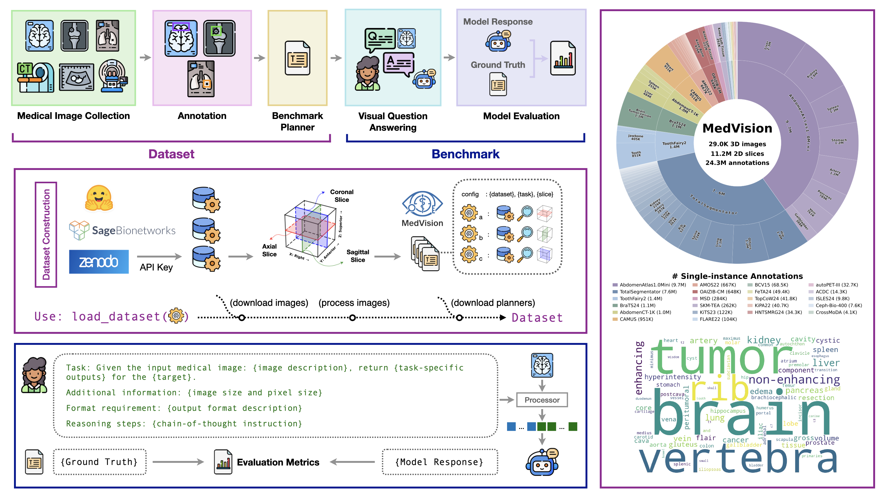

  

    
  

  
  
  

## 🌟 Highlights

* **Research gap.** Modern VLMs cannot reliably produce precise quantitative measurements from medical images.
* **Dataset.** MedVision `v1.0.0` — a large-scale, multi-anatomy, multi-modality dataset for quantitative medical image analysis (22 public datasets, 29.0K 3D images, 11.2M annotated 2D slices, 24.3M single-instance annotations, and 45.3M multi-instance annotations); see the [Dataset Explorer](explorer.html) for later releases. 
* **Benchmark.** The first comprehensive evaluation of contemporary VLMs on detection, tumor/lesion (T/L) size estimation, and angle/distance (A/D) measurement in medical images.
* **Model.** MedVision-V0, a 7B model trained on MedVision via supervised fine-tuning (SFT) and reinforcement fine-tuning (RFT); it significantly outperforms all evaluated VLMs across all three tasks — a strong, open baseline.
* **Open release.** Data, model, and code (training and evaluation) are all publicly available.

  
  
  

## 🎯 Problem & Tasks

Clinical decisions rely on quantitative assessment — measuring a tumor to stage disease, a joint angle to plan surgery, an anatomical distance to track development. We therefore target a concrete model ability: ***given a medical image, produce precise numeric measurements in real-world physical units*** (millimeters and degrees, *not* pixels). 

MedVision evaluates this ability across three quantitative tasks:

  

    <h3>1️⃣ Detection</h3>
    
Localize healthy anatomical structures and abnormalities with bounding boxes.

  

  

    <h3>2️⃣ Tumor/Lesion Size</h3>
    
Estimate the longest diameter (major axis) and its perpendicular diameter (minor axis) of a tumor/lesion, reported in millimeters.

  

  

    <h3>3️⃣ Angle/Distance</h3>
    
Measure angles (degrees) and distances (mm) from anatomical landmarks.

  

  
  
  

## 📈 Leaderboard

*Last updated: Sep 3, 2026*

**MedVision-V0 outperforms all 17 evaluated off-the-shelf VLMs across all three quantitative task families.** Each task below leads with the full leaderboard (🥇/🥈/🥉 mark the best three per column; click any metric to rank the table by it, best first; underlined metrics belong to a sub-task whose success rate fell below 50%, meaning they are computed on a minority of samples and should be read with care), followed by an interactive viewer of real predictions — the complete prompt, the model's chain-of-thought response, and the error metrics, beside the image with a ground-truth-vs-prediction overlay.

### 1️⃣ Detection

<b>Table 2:</b> Detection performance (%), grouped into anatomy and tumor/lesion targets. R: recall; P: precision; F1: F1 score; IoU: intersection over union; SR: success rate.

<table class="mv-sortable" data-default-sort="2">
  <thead>
    <tr>
      <th rowspan="2"><b>Model</b></th>
      <th colspan="6"><b>Anatomy (18 regions, 13.4K samples)</b></th>
      <th colspan="6"><b>Tumor/Lesion (8 regions, 8.5K samples)</b></th>
    </tr>
    <tr>
      <th><b>R</b> &uarr;</th><th><b>P</b> &uarr;</th><th><b>F1</b> &uarr;</th><th><b>IoU</b> &uarr;</th><th><b>SR</b> &uarr;</th><th><b>IoU&gt;0.5</b> &uarr;</th>
      <th><b>R</b> &uarr;</th><th><b>P</b> &uarr;</th><th><b>F1</b> &uarr;</th><th><b>IoU</b> &uarr;</th><th><b>SR</b> &uarr;</th><th><b>IoU&gt;0.5</b> &uarr;</th>
    </tr>
  </thead>
  <tbody>
    <tr class="is-mv"><td>MedVision-V0 (7B)</td><td>81.3🥇</td><td>80.4🥇</td><td>79.1🥇</td><td>72.0🥇</td><td>100</td><td>80.1🥇</td><td>52.4</td><td>50.5🥇</td><td>46.9🥇</td><td>38.2🥇</td><td>100</td><td>40.7🥇</td></tr>
    <tr><td>Gemma-4 (31B)</td><td>34.8</td><td>20.7🥈</td><td>22.6🥈</td><td>16.7🥈</td><td>98.5</td><td>13.5🥈</td><td>43.6</td><td>14.6🥈</td><td>18.1🥈</td><td>12.7🥈</td><td>99.5</td><td>8.4🥈</td></tr>
    <tr><td>Lingshu (32B)</td><td>37.4</td><td>20.2🥉</td><td>20.2🥉</td><td>13.7🥉</td><td>100</td><td>6.7</td><td>40.2</td><td>6.0</td><td>8.6</td><td>5.1</td><td>100</td><td>0.2</td></tr>
    <tr><td>GLM-4.6V (106B)</td><td>46.5</td><td>16.4</td><td>20.2🥉</td><td>13.5</td><td>99.9</td><td>6.0</td><td>52.4</td><td>5.1</td><td>7.7</td><td>4.6</td><td>99.8</td><td>0.5</td></tr>
    <tr><td>Qwen3-VL-Thinking (32B)</td><td>35.8</td><td>17.4</td><td>19.5</td><td>13.4</td><td>96.5</td><td>7.5🥉</td><td>33.9</td><td>6.6</td><td>8.2</td><td>5.2</td><td>98.0</td><td>1.3</td></tr>
    <tr><td>MedGemma (27B)</td><td>57.2</td><td>15.7</td><td>19.1</td><td>12.9</td><td>98.6</td><td>6.6</td><td>54.1</td><td>4.6</td><td>7.5</td><td>4.3</td><td>97.0</td><td>0.1</td></tr>
    <tr><td>MedGemma (4B)</td><td>68.7🥉</td><td>14.7</td><td>18.6</td><td>12.4</td><td>98.9</td><td>6.4</td><td>77.7🥇</td><td>4.4</td><td>7.5</td><td>4.2</td><td>99.3</td><td>0.0</td></tr>
    <tr><td>Qwen2.5-VL (32B)</td><td>44.8</td><td>14.9</td><td>18.4</td><td>12.5</td><td>100</td><td>6.3</td><td>38.5</td><td>5.7</td><td>7.7</td><td>4.7</td><td>100</td><td>0.6</td></tr>
    <tr><td>LLaVA-OneVision (72B)</td><td>34.9</td><td>19.0</td><td>18.1</td><td>11.8</td><td>100</td><td>2.4</td><td>34.1</td><td>6.3</td><td>8.4</td><td>5.0</td><td>100</td><td>0.4</td></tr>
    <tr><td>MiniMax-M3 (428B, int4)</td><td>32.5</td><td>15.4</td><td>17.5</td><td>11.8</td><td>99.9</td><td>5.6</td><td>35.7</td><td>7.8🥉</td><td>10.2🥉</td><td>6.5🥉</td><td>100</td><td>1.6🥉</td></tr>
    <tr><td>InternVL3 (38B)</td><td>31.1</td><td>17.0</td><td>17.2</td><td>11.5</td><td>100</td><td>5.3</td><td>29.5</td><td>6.6</td><td>7.9</td><td>4.9</td><td>100</td><td>0.8</td></tr>
    <tr><td>Qwen2.5-VL (7B)</td><td>69.7🥈</td><td>12.2</td><td>16.7</td><td>11.3</td><td>99.4</td><td>5.6</td><td>77.4🥈</td><td>3.8</td><td>6.5</td><td>3.6</td><td>99.6</td><td>0.0</td></tr>
    <tr><td>HealthGPT (14B)</td><td>29.6</td><td>20.7🥈</td><td>16.0</td><td>10.2</td><td>98.7</td><td>1.8</td><td>29.2</td><td>7.0</td><td>8.4</td><td>5.1</td><td>97.8</td><td>0.5</td></tr>
    <tr><td>GLM-4.6V-Flash (9B)</td><td>22.6</td><td>17.6</td><td>15.2</td><td>9.8</td><td>100</td><td>2.5</td><td>26.2</td><td>6.1</td><td>7.5</td><td>4.7</td><td>100</td><td>1.0</td></tr>
    <tr><td>HuatuoGPT-Vision (34B)</td><td>25.6</td><td>17.7</td><td>15.1</td><td>9.8</td><td>99.5</td><td>2.7</td><td>21.6</td><td>5.0</td><td>6.4</td><td>3.8</td><td>99.0</td><td>0.3</td></tr>
    <tr><td>Gemma-3 (27B)</td><td>37.1</td><td>12.4</td><td>14.9</td><td>10.1</td><td>100</td><td>4.6</td><td>34.3</td><td>4.3</td><td>6.1</td><td>3.6</td><td>100</td><td>0.3</td></tr>
    <tr><td>MedDr (40B)</td><td>53.6</td><td>11.1</td><td>14.6</td><td>9.7</td><td>96.8</td><td>4.2</td><td>63.4🥉</td><td>3.7</td><td>6.2</td><td>3.5</td><td>98.7</td><td>0.1</td></tr>
    <tr><td>Llama-3.2-Vision (11B)</td><td>52.2</td><td>12.7</td><td>14.3</td><td>9.4</td><td>89.4</td><td>3.2</td><td>49.0</td><td>3.6</td><td>5.9</td><td>3.4</td><td>85.4</td><td>0.1</td></tr>
  </tbody>
</table>

### 2️⃣ Tumor/Lesion Size

<b>Table 3:</b> Tumor/lesion size estimation (2K samples). MAE in millimeters; MRE, SR, and MRE&lt;0.1 in %.

<table class="mv-center mv-sortable" data-default-sort="0">
  <thead>
    <tr>
      <th><b>Model</b></th>
      <th><b>MAE</b> &darr;</th>
      <th><b>MRE</b> &darr;</th>
      <th><b>SR</b> &uarr;</th>
      <th><b>MRE&lt;0.1</b> &uarr;</th>
    </tr>
  </thead>
  <tbody>
    <tr class="is-mv"><td>MedVision-V0 (7B)</td><td>10.5🥇</td><td>26.0🥇</td><td>100.0</td><td>23.5🥇</td></tr>
    <tr><td>Gemma-4 (31B)</td><td>21.7🥈</td><td>72.6🥈</td><td>98.9</td><td>16.8🥈</td></tr>
    <tr><td>GLM-4.6V (106B)</td><td>31.4🥉</td><td>107.3🥉</td><td>92.2</td><td>4.1</td></tr>
    <tr><td>MiniMax-M3 (428B, int4)</td><td>32.7</td><td>108.1</td><td>95.8</td><td>5.6</td></tr>
    <tr><td>GLM-4.6V-Flash (9B)</td><td>34.4</td><td>109.2</td><td>95.2</td><td>3.0</td></tr>
    <tr><td>Lingshu (32B)</td><td>35.7</td><td>118.6</td><td>99.5</td><td>4.5</td></tr>
    <tr><td>HealthGPT (14B)</td><td>51.8</td><td>176.0</td><td>100.0</td><td>2.2</td></tr>
    <tr><td>Qwen3-VL-Thinking (32B)</td><td>53.2</td><td>140.6</td><td>94.0</td><td>6.2🥉</td></tr>
    <tr><td>MedDr (40B)</td><td>78.0</td><td>240.7</td><td>87.3</td><td>1.9</td></tr>
    <tr><td>Llama-3.2-Vision (11B)</td><td>101.2</td><td>329.4</td><td>98.3</td><td>0.7</td></tr>
    <tr><td>Gemma-3 (27B)</td><td>225.8</td><td>611.4</td><td>99.0</td><td>0.5</td></tr>
    <tr><td>MedGemma (27B)</td><td>523.4</td><td>1905.0</td><td>57.0</td><td>0.5</td></tr>
    <tr><td>HuatuoGPT-Vision (34B)</td><td>1018.6</td><td>2847.2</td><td>98.3</td><td>1.5</td></tr>
    <tr><td>LLaVA-OneVision (72B)</td><td>1089.1</td><td>3368.0</td><td>100.0</td><td>1.2</td></tr>
    <tr><td>Qwen2.5-VL (32B)</td><td>2054.6</td><td>6989.2</td><td>99.9</td><td>1.3</td></tr>
    <tr><td>Qwen2.5-VL (7B)</td><td>2897.2</td><td>7680.9</td><td>95.4</td><td>0.7</td></tr>
    <tr><td>InternVL3 (38B)</td><td>8606.8</td><td>25285.1</td><td>100.0</td><td>0.2</td></tr>
    <tr><td>MedGemma (4B)</td><td>1109532.7</td><td>3733526.8</td><td>90.9</td><td>0.1</td></tr>
  </tbody>
</table>

### 3️⃣ Angle/Distance

<b>Table 4:</b> Angle/distance measurement across all 17 off-the-shelf VLMs and MedVision-V0, for each sub-task. MAE in millimeters (distance) and degrees (angle); MRE, SR, and MRE&lt;0.1 in %.

  

    <button type="button" class="mv-tab is-active" role="tab" id="ad-tab-distance" aria-controls="ad-panel-distance" aria-selected="true">Distance</button>
    <button type="button" class="mv-tab" role="tab" id="ad-tab-angle" aria-controls="ad-panel-angle" aria-selected="false">Angle</button>
  

  

<table class="mv-center mv-sortable" data-default-sort="0">
  <thead>
    <tr>
      <th rowspan="2"><b>Model</b></th>
      <th colspan="4"><b>Ceph-Bio-400 + FeTA24 &middot; Distance (1,100 samples)</b></th>
    </tr>
    <tr>
      <th><b>MAE</b> &darr;</th><th><b>MRE</b> &darr;</th><th><b>SR</b> &uarr;</th><th><b>MRE&lt;0.1</b> &uarr;</th>
    </tr>
  </thead>
  <tbody>
    <tr class="is-mv"><td>MedVision-V0 (7B)</td><td>3.6🥇</td><td>6.4🥇</td><td>100</td><td>81.4🥇</td></tr>
    <tr><td>MiniMax-M3 (428B, int4)</td><td>18.0🥈</td><td>30.4🥈</td><td>97.5</td><td>22.0🥈</td></tr>
    <tr><td>GLM-4.6V (106B)</td><td>22.7🥉</td><td>41.5</td><td>88.4</td><td>14.2</td></tr>
    <tr><td>HealthGPT (14B)</td><td>23.1</td><td>42.4</td><td>97.6</td><td>18.0</td></tr>
    <tr><td>Gemma-4 (31B)</td><td>23.8</td><td>37.9🥉</td><td>99.8</td><td>10.8</td></tr>
    <tr><td>GLM-4.6V-Flash (9B)</td><td>30.3</td><td>56.0</td><td>99.7</td><td>12.5</td></tr>
    <tr><td>MedDr (40B)</td><td>106.3</td><td>197.6</td><td>91.2</td><td>8.5</td></tr>
    <tr><td>Qwen3-VL-Thinking (32B)</td><td>119.0</td><td>197.8</td><td>98.4</td><td>18.6</td></tr>
    <tr><td>Lingshu (32B)</td><td>198.8</td><td>247.7</td><td>100</td><td>21.4🥉</td></tr>
    <tr><td>LLaVA-OneVision (72B)</td><td>2541.7</td><td>4557.2</td><td>100</td><td>6.1</td></tr>
    <tr><td>HuatuoGPT-Vision (34B)</td><td>3921.6</td><td>6251.5</td><td>98.2</td><td>5.4</td></tr>
    <tr><td>Llama-3.2-Vision (11B)</td><td>4666.2</td><td>7065.8</td><td>98.6</td><td>2.1</td></tr>
    <tr><td>Gemma-3 (27B)</td><td>5054.2</td><td>6606.9</td><td>99.0</td><td>13.3</td></tr>
    <tr><td>MedGemma (27B)</td><td>6239.0</td><td>8616.4</td><td>46.2</td><td>6.7</td></tr>
    <tr><td>MedGemma (4B)</td><td>15222.0</td><td>24918.0</td><td>95.1</td><td>0.1</td></tr>
    <tr><td>Qwen2.5-VL (32B)</td><td>56045.7</td><td>71734.7</td><td>99.9</td><td>6.3</td></tr>
    <tr><td>InternVL3 (38B)</td><td>62066.9</td><td>62191.8</td><td>99.8</td><td>8.0</td></tr>
    <tr><td>Qwen2.5-VL (7B)</td><td>63603.8</td><td>96542.0</td><td>98.3</td><td>0.5</td></tr>
  </tbody>
</table>
  

  

<table class="mv-center mv-sortable" data-default-sort="0">
  <thead>
    <tr>
      <th rowspan="2"><b>Model</b></th>
      <th colspan="4"><b>Ceph-Bio-400 &middot; Angle (960 samples)</b></th>
    </tr>
    <tr>
      <th><b>MAE</b> &darr;</th><th><b>MRE</b> &darr;</th><th><b>SR</b> &uarr;</th><th><b>MRE&lt;0.1</b> &uarr;</th>
    </tr>
  </thead>
  <tbody>
    <tr class="is-mv"><td>MedVision-V0 (7B)</td><td>4.7🥇</td><td>52.1🥇</td><td>99.9</td><td>52.0🥇</td></tr>
    <tr><td>MiniMax-M3 (428B, int4)</td><td>17.9🥈</td><td>477.1</td><td>48.6</td><td>8.5</td></tr>
    <tr><td>GLM-4.6V (106B)</td><td>19.7🥉</td><td>322.7</td><td>88.8</td><td>20.9🥈</td></tr>
    <tr><td>Gemma-4 (31B)</td><td>23.9</td><td>428.0</td><td>88.5</td><td>11.7</td></tr>
    <tr><td>HealthGPT (14B)</td><td>25.9</td><td>463.2</td><td>99.3</td><td>16.7</td></tr>
    <tr><td>InternVL3 (38B)</td><td>30.3</td><td>616.8</td><td>100</td><td>20.4🥉</td></tr>
    <tr><td>Qwen3-VL-Thinking (32B)</td><td>32.4</td><td>378.2</td><td>69.6</td><td>3.6</td></tr>
    <tr><td>LLaVA-OneVision (72B)</td><td>33.6</td><td>473.5</td><td>100</td><td>2.9</td></tr>
    <tr><td>Llama-3.2-Vision (11B)</td><td>34.2</td><td>287.1🥉</td><td>100</td><td>3.2</td></tr>
    <tr><td>Lingshu (32B)</td><td>35.0</td><td>512.5</td><td>100</td><td>6.3</td></tr>
    <tr><td>GLM-4.6V-Flash (9B)</td><td>35.0</td><td>531.7</td><td>99.1</td><td>8.1</td></tr>
    <tr><td>MedGemma (4B)</td><td>35.8</td><td>298.8</td><td>96.7</td><td>6.0</td></tr>
    <tr><td>Gemma-3 (27B)</td><td>36.3</td><td>702.2</td><td>99.9</td><td>6.7</td></tr>
    <tr><td>Qwen2.5-VL (32B)</td><td>41.2</td><td>258.3🥈</td><td>99.2</td><td>1.0</td></tr>
    <tr><td>MedDr (40B)</td><td>45.7</td><td>591.5</td><td>94.5</td><td>5.3</td></tr>
    <tr><td>MedGemma (27B)</td><td>46.4</td><td>1024.8</td><td>93.0</td><td>6.8</td></tr>
    <tr><td>Qwen2.5-VL (7B)</td><td>48.0</td><td>724.9</td><td>97.6</td><td>2.0</td></tr>
    <tr><td>HuatuoGPT-Vision (34B)</td><td>7070.0</td><td>9032.7</td><td>95.4</td><td>3.7</td></tr>
  </tbody>
</table>
  

  
  
  

## 🔬 Pilot Study: Frontier API Models

Running API-served frontier VLMs across the entire benchmark is prohibitively costly — the test set spans multiple tasks, each with a large number of samples. We therefore conduct a pilot study that evaluates frontier API models on a small testing subset per task (Tumor/Lesion Size for now), reusing the exact prompts and samples from the full benchmark. This pilot study benchmarks how capable today's frontier models are at quantitative medical image measurement, facilitating the design of agentic AI systems for biomedical applications.

<b>Table 5:</b> Pilot study on tumor/lesion size estimation using a small testing subset (750 samples). MAE in millimeters; MRE, SR, and MRE&lt;0.1 in %. Cost is the total API evaluation spend in USD.

<table class="mv-center mv-sortable" data-default-sort="0">
  <thead>
    <tr>
      <th><b>Model</b></th>
      <th><b>MAE</b> &darr;</th>
      <th><b>MRE</b> &darr;</th>
      <th><b>SR</b> &uarr;</th>
      <th><b>MRE&lt;0.1</b> &uarr;</th>
      <th><b>Cost</b></th>
    </tr>
  </thead>
  <tbody>
    <tr class="is-mv"><td>MedVision-V0 (7B)</td><td>9.6🥇</td><td>26.9🥇</td><td>100.0</td><td>24.1🥇</td><td>$0</td></tr>
    <tr><td>Claude-Fable-5</td><td>12.5</td><td>46.5</td><td>100.0</td><td>23.7</td><td>$63.9</td></tr>
    <tr><td>Gemini-3.1-Pro</td><td>14.9</td><td>48.8</td><td>79.2 &dagger;</td><td>18.1</td><td>$101.3</td></tr>
    <tr><td>GPT-5.5-Pro &Dagger;490 of 750 samples</td><td>13.7</td><td>52.4</td><td>100.0</td><td>23.7</td><td>$959</td></tr>
  </tbody>
</table>

<b>&dagger;</b> All API models were run with the same 16,000-token output budget. Gemini-3.1-Pro's thinking (non-disableable, default level) shares that budget with the answer; ~20% of responses exhaust it on reasoning and return empty/truncated output, lowering SR.

<b>&Dagger;</b> GPT-5.5-Pro was evaluated on 490 of the 750 samples: the run stopped after 6 of the 10 dataset tasks when its API spending budget was exhausted (a cost limit, not the token limit). Its metrics are computed over those 490 samples and are not directly comparable to the full-subset rows. Liver tumor and enhancing brain tumor were not evaluated, and kidney tumor covers KiPA22 only (100 of 199 samples); Table 6 and the radar below leave all three targets empty as incomplete.

<b>Table 6:</b> Per-target MRE and SR (%) of the pilot-study models; n is the number of samples per target in the 750-sample subset; the miscellaneous tumor/lesion group (52 samples) is omitted, as in the radar below.

<table class="mv-sortable" data-default-sort="0">
  <thead>
    <tr>
      <th rowspan="2"><b>Model</b></th>
      <th colspan="2"><b>kidney tumor</b>CT (A) &middot; n=199</th>
      <th colspan="2"><b>liver tumor</b>CT (A) &middot; n=118</th>
      <th colspan="2"><b>brain tumor</b>MR (A) &middot; n=96</th>
      <th colspan="2"><b>brain resection cavity</b>MR (A) &middot; n=91</th>
      <th colspan="2"><b>non-enhancing brain tumor</b>MR (A) &middot; n=88</th>
      <th colspan="2"><b>metastatic lymph node</b>MR (A) &middot; n=63</th>
      <th colspan="2"><b>enhancing brain tumor</b>MR (A) &middot; n=43</th>
    </tr>
    <tr>
      <th><b>MRE</b> &darr;</th><th><b>SR</b> &uarr;</th>
      <th><b>MRE</b> &darr;</th><th><b>SR</b> &uarr;</th>
      <th><b>MRE</b> &darr;</th><th><b>SR</b> &uarr;</th>
      <th><b>MRE</b> &darr;</th><th><b>SR</b> &uarr;</th>
      <th><b>MRE</b> &darr;</th><th><b>SR</b> &uarr;</th>
      <th><b>MRE</b> &darr;</th><th><b>SR</b> &uarr;</th>
      <th><b>MRE</b> &darr;</th><th><b>SR</b> &uarr;</th>
    </tr>
  </thead>
  <tbody>
    <tr class="is-mv"><td>MedVision-V0 (7B)</td><td>35.3</td><td>100.0</td><td>31.4</td><td>100.0</td><td>25.9</td><td>100.0</td><td>21.5</td><td>100.0</td><td>15.2</td><td>100.0</td><td>28.3</td><td>100.0</td><td>11.7</td><td>100.0</td></tr>
    <tr><td>Claude-Fable-5</td><td>55.5</td><td>100.0</td><td>64.4</td><td>100.0</td><td>59.5</td><td>100.0</td><td>14.1</td><td>100.0</td><td>40.3</td><td>100.0</td><td>42.2</td><td>100.0</td><td>20.8</td><td>100.0</td></tr>
    <tr><td>Gemini-3.1-Pro &dagger;</td><td>64.9</td><td>73.9</td><td>63.2</td><td>70.3</td><td>42.8</td><td>83.3</td><td>22.5</td><td>82.4</td><td>50.8</td><td>86.4</td><td>37.6</td><td>84.1</td><td>14.7</td><td>90.7</td></tr>
    <tr><td>GPT-5.5-Pro</td><td>&mdash;</td><td>&mdash;</td><td>&mdash;</td><td>&mdash;</td><td>76.4</td><td>100.0</td><td>24.4</td><td>100.0</td><td>55.8</td><td>100.0</td><td>97.4</td><td>100.0</td><td>&mdash;</td><td>&mdash;</td></tr>
  </tbody>
</table>

<b>&dagger;</b> SR below 100% for the reason given under Table 5.

<b>&mdash;</b> Not evaluated or incomplete: GPT-5.5-Pro's run stopped after 6 of the 10 dataset tasks (490 of 750 samples) when the API budget ran out, skipping the KiTS23 and MSD tasks. Liver tumor and enhancing brain tumor were never evaluated, and its kidney-tumor result (KiPA22 only, 100 of 199 samples) is omitted as incomplete.

  
  
  

## 🤝 Call for Models

MedVision is an open, growing leaderboard — we keep adding models as the field moves. If there is a vision language model you would like to see evaluated on the benchmark, please [🧑🏻‍💻**open a GitHub issue**](https://github.com/YongchengYAO/MedVision/issues/new) with the model name and a link to its weights or API, and we will consider it for a future evaluation round.

Pull requests are equally welcome. Our [📚 **New Models Guide**](https://medvision.readthedocs.io/en/latest/extending/add-a-model.html) walks through everything needed to plug a new VLM into the benchmark — a PR contributing complete, working inference code for a model is the fastest route onto the leaderboard.

